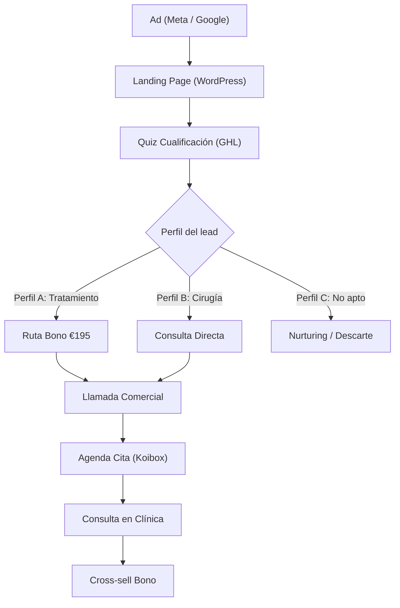

# 📋 Hospital Capilar — Documento Madre

Description: Documento maestro del proyecto Hospital Capilar (Tratamientos Capilares). Índice completo con enlaces a todos los documentos, reuniones, análisis y tareas del proyecto. Última actualización: 25 Feb 2026.
Created: 25 de febrero de 2026 15:27
Created by: Philippe Sainthubert
Status: Draft
Tasks & Projects: Armar planning proyecto Hospital Capilar (https://www.notion.so/Armar-planning-proyecto-Hospital-Capilar-3025dacf4f14802b8a44d408c10aff37?pvs=21), Comenzar el GTM de Hospital Capilar (https://www.notion.so/Comenzar-el-GTM-de-Hospital-Capilar-3105dacf4f14805f9c67d9f0133559c0?pvs=21)

## Proyecto: Tratamientos Capilares — Hospital Capilar × Growth4U

<aside>
🎯

**Objetivo:** +€50K/mes facturación incremental en tratamientos capilares

**Piloto:** Madrid → escalar a Murcia, Pontevedra y 6 nuevas clínicas

**Timeline:** 9 semanas (24 Feb → 25 Abr 2026)

**Fase actual:** Semana 1 — GTM Strategy + Onboarding técnico

</aside>

---

## 1. 🗂️ Propuesta y Acuerdos Comerciales

Documentos que definen el alcance, precio y estructura del proyecto.

| Documento | Descripción | Estado |
| --- | --- | --- |
| [Propuesta Growth4U → Hospital Capilar | Proyecto Tratamientos](https://www.notion.so/Propuesta-Growth4U-Hospital-Capilar-Proyecto-Tratamientos-a52139dd14fa49bba3d5f2271cd56566?pvs=21) | Propuesta comercial original enviada a HC. Define las 3 fases del proyecto, objetivos, metodología Trust Engine y entregables. | ✅ Firmada |
| [Mandar propuesta completa de Hospital Capilar y que firmen](https://www.notion.so/Mandar-propuesta-completa-de-Hospital-Capilar-y-que-firmen-2ff5dacf4f14805e98c5f11ef0f9c18d?pvs=21) | Datos fiscales del cliente (Hospital Capilar Central SL, CIF B02867125), estructura de pagos (€50K total: €20K Fases 1-2 + €30K Fase 3) y calendario de facturación. | ✅ Archivada |
| [Revisión Propuesta Hospital Capilar — Feedback para Alfonso](https://www.notion.so/Revisi-n-Propuesta-Hospital-Capilar-Feedback-para-Alfonso-6bf81762ca374ed6a9d817c81f6901e4?pvs=21) | Feedback interno sobre la propuesta antes de enviarla al cliente. | ✅ Completada |

---

## 2. 📊 Análisis y Datos del Cliente

Toda la inteligencia sobre el negocio, métricas, competencia y mercado.

| Documento | Descripción | Datos clave |
| --- | --- | --- |
| [Form Inicial Cliente - Hospital Capilar](https://www.notion.so/Form-Inicial-Cliente-Hospital-Capilar-a21ebc340f57406b8d2e9e4bc7a8e95c?pvs=21) | Formulario de onboarding completo. ICP, funnel actual, competencia, objeciones, compliance, equipo, tech stack y métricas base. | 3 clínicas, 6 aperturas 2026, margen tratamientos 90% |
| [Análisis Estadísticas Hospital Capilar — 2023-2026](https://www.notion.so/An-lisis-Estad-sticas-Hospital-Capilar-2023-2026-7077092b46264775a52aa39e310cf785?pvs=21) | Análisis exhaustivo de los 4 PDFs de HC. Evolución cirugías vs tratamientos, ROI por canal, modelo económico, datos enero 2026 y conclusiones estratégicas. | Tratamientos +88% (2023→2025), Google 5x mejor conversión que Meta, SEO 10x mejor |
| [Documentos iniciales Hospital Capilar](https://www.notion.so/Documentos-iniciales-Hospital-Capilar-2ff5dacf4f14800cabc8cbd37432fc32?pvs=21) | PDFs originales entregados por HC: Comparativa 2023-2025, Resumen y Aperturas, Diciembre 2025. | Fuente primaria de datos |

### Métricas clave consolidadas

<aside>
📈

**Tratamientos 2025:** 1.828 (+88% vs 2023) sin inversión dedicada

**Baseline actual:** ~152 tratamientos/mes. Madrid ~84/mes

**Margen tratamientos:** 90% vs 40% cirugía

**Ticket medio bono:** ~€820 | Consulta: €195

**Conversión estimada:** ~50% consulta → bono (pendiente validar)

</aside>

<aside>
💰

**ROI por canal (2025, mix cirugía+tratamientos):**

- **SEO:** ROI 6.915%, conversión 28,8%, CAC €25
- **Google Ads:** ROI 213%, conversión 14,2%, CAC €563
- **Meta:** ROI 164%, conversión 2,95%, CAC €668
- **ChatGPT (Ene 2026):** 9 leads, 11,1% conversión → valida IEO/GEO
</aside>

---

## 3. 🗺️ Estrategia GTM y Planning

Documentos estratégicos que definen el qué, cómo y cuándo del proyecto.

| Documento | Descripción | Contenido principal |
| --- | --- | --- |
| [GTM Hospital Capilar](https://www.notion.so/GTM-Hospital-Capilar-d7bd621c1605417f876f2a50695a4103?pvs=21) | Proceso GTM completo en 7 bloques: desde investigación de mercado hasta activación y escala. Framework metodológico del proyecto. | 7 bloques GTM, market sizing, ICP, canales, mensajes, funnel, métricas |
| [Armar planning proyecto Hospital Capilar](https://www.notion.so/Armar-planning-proyecto-Hospital-Capilar-3025dacf4f14802b8a44d408c10aff37?pvs=21) | **Retroplanning de 9 semanas** (24 Feb → 25 Abr). Incluye fases completadas (Pre-Kickoff, Discovery, Onboarding técnico) y semanas 1-9 con acciones, responsables y entregables. | Semana a semana con responsables, entregables y dependencias de HC |

### Timeline resumido

| Semana | Fecha | Foco | Estado |
| --- | --- | --- | --- |
| Pre-Kickoff | 10–14 Feb | Formulario, Telegram, email Alfonso | ✅ Done |
| Discovery | 16 Feb | Sesión Discovery/Kickoff 2.5h con equipo HC | ✅ Done |
| Onboarding técnico | 17–19 Feb | Ramiro onboarded, propuesta GHL aprobada | ✅ Done |
| **S1** | 24–28 Feb | GTM Strategy: competidores, nichos, oferta, canales, mensajes | 🔵 En curso |
| S2 | 3–7 Mar | GTM Cierre + Ramiro arranca GHL | ⏳ |
| S3 | 10–14 Mar | Quiz + CRM + Automatizaciones | ⏳ |
| S4 | 17–21 Mar | Quiz + CRM + Landing Pages | ⏳ |
| S5 | 24–28 Mar | Landing Pages + Preparación Launch | ⏳ |
| S6 | 31 Mar – 4 Abr | Nurturing + Soporte Comercial | ⏳ |
| **S7** | 7–11 Abr | 🚀 **Soft Launch** — Primeros ads y leads reales | ⏳ |
| S8 | 14–18 Abr | Métricas + Testing Intensivo | ⏳ |
| **S9** | 21–25 Abr | 🏁 **Go Live completo** — Sistema a plena capacidad | ⏳ |

---

## 4. 🔥 Mandato de Gerardo (25 Feb 2026) — NUEVO

<aside>
🔴

**Directriz:** Hacer *challenge* a **todas** las suposiciones de Óscar. Quiere algo completamente nuevo para la empresa.

</aside>

**Documento de referencia:** [Feedback Hospital Capilar — Reunión con Gerardo (25 Feb 2026)](https://www.notion.so/Feedback-Hospital-Capilar-Reuni-n-con-Gerardo-25-Feb-2026-41f53547e0004df68b1decde5677a53f?pvs=21)

### Insight clave

> *"La gente no sabe lo que es un tratamiento capilar."* — Entre el Pilexil y la cirugía hay un mundo entero que la gente desconoce.
> 

### 3 Flujos de Quiz a testear en paralelo

| Flujo | Descripción | Pago | Hipótesis |
| --- | --- | --- | --- |
| **A** | Quiz súper sencillo — mínimas preguntas, máxima velocidad | Sin pago | Volumen alto, cualificación baja → conversión en consulta |
| **B** | Quiz + pago (195€ / 100€ / 50€) | Variable | Volumen menor, leads ultra-cualificados |
| **C** | Quiz largo y completo, sin pago | Sin pago | Cualificación por información, no por dinero |

### Suposiciones a cuestionar

- Precio del bono a €195 — ¿es el óptimo?
- Quiz de 10-15 preguntas — ¿hace falta tantas?
- Segmentación hombres/mujeres — ¿es la mejor forma?
- Cobrar tratamiento pero no cirugía — ¿tiene sentido?
- Necesidad de médico en primer contacto

---

## 5. 🔧 Onboarding Técnico — Ramiro / GoHighLevel

Documentos relacionados con la infraestructura técnica y el especialista GHL.

| Documento | Descripción | Estado |
| --- | --- | --- |
| [ Onboarding Completo Ramiro — Proyecto Hospital Capilar (Tratamientos)](https://www.notion.so/Onboarding-Completo-Ramiro-Proyecto-Hospital-Capilar-Tratamientos-56326ef6f1f0484081d1a411b3bb73ed?pvs=21) | **Documento maestro de onboarding para Ramiro.** Incluye TODO: contexto del negocio, arquitectura técnica GHL, scope 8 semanas, campañas actuales, competencia, restricciones legales, mandato de Gerardo, action items y contactos. | 📌 Más completo |
| [Hospital Capilar — Avances Proyecto & Onboarding Ramiro (25 Feb 2026)](https://www.notion.so/Hospital-Capilar-Avances-Proyecto-Onboarding-Ramiro-25-Feb-2026-dab70b67efa84698aa0801e63ffbd9f3?pvs=21) | Documento consolidado de avances del proyecto a fecha 25 Feb. Incluye versión anterior del onboarding de Ramiro + resumen de estado actual. | Draft |
| [Ramiro <> Growth4U **19 de febrero de 2026 11:00**](https://www.notion.so/Ramiro-Growth4U-30c5dacf4f14808e9f80df725b68dd0b?pvs=21) | Notas de la reunión de presentación con Ramiro Pérez Rodero (especialista GHL vía Shakers). Acuerdos: 8 semanas, 3h/día, €3.600+IVA/mes. Arquitectura técnica: WP + webhooks + GHL. | Draft |

### Arquitectura técnica (resumen)

### Decisiones técnicas tomadas

- ✅ Landings en **WordPress**, no en GHL
- ✅ **Webhooks** de WP a GHL para captura de datos
- ✅ **Tags condicionales** por origen, perfil y ubicación
- ✅ **Notificaciones Telegram** con datos completos del lead
- ✅ **No Web2Wave** ($200/mes) — quiz dentro de GHL
- ✅ **No tocamos Salesforce** — sistema 100% independiente en GHL
- ✅ **3 variantes de quiz** en paralelo (mandato Gerardo)

### Scope Ramiro — 8 semanas (3 Mar → 25 Abr)

| Semana | Fecha | Entregable |
| --- | --- | --- |
| S1 | 3–7 Mar | Setup GHL: pipelines, custom fields, tags, CRM, integraciones base |
| S2 | 10–14 Mar | 3 variantes quiz + CRM pipeline + automatizaciones + Telegram |
| S3 | 17–21 Mar | Completar quiz + CRM + iniciar landing pages por nicho |
| S4 | 24–28 Mar | Landings finalizadas + QA completo funnel |
| S5 | 31 Mar – 4 Abr | Nurturing automatizado (Email + WhatsApp) |
| S6 | 7–11 Abr | Completar nurturing + **Soft Launch** |
| S7 | 14–18 Abr | Dashboard métricas en tiempo real |
| S8 | 21–25 Abr | Optimización final + **Go Live completo** |

---

## 6. 🎙️ Reuniones (orden cronológico)

Histórico completo de todas las reuniones del proyecto.

| Fecha | Reunión | Asistentes | Contenido clave |
| --- | --- | --- | --- |
| 6 Feb | [**Hospital Capilar Growth4U Sales Presentation 6 de febrero de 2026 11:47**](https://www.notion.so/Hospital-Capilar-Growth4U-Sales-Presentation-2ff5dacf4f1480a2a434f3f9060a3bf1?pvs=21) | Alfonso, Philippe, Óscar | Presentación inicial. Óscar describe el negocio, los 3 segmentos, la oportunidad de tratamientos y el equipo. |
| 9 Feb | [Reunion MKT - HOSPITAL CAPILAR **9 de febrero de 2026 13:00**](https://www.notion.so/Reunion-MKT-HOSPITAL-CAPILAR-3025dacf4f14806091decd6c78b55ee4?pvs=21) | Alfonso, Philippe, equipo MKT HC | Sesión con equipo de marketing. Discusión de canales, presupuesto, creative guidelines. |
| 19 Feb | [Ramiro <> Growth4U **19 de febrero de 2026 11:00**](https://www.notion.so/Ramiro-Growth4U-30c5dacf4f14808e9f80df725b68dd0b?pvs=21) | Philippe, Ramiro | Presentación del proyecto a Ramiro. Acuerdos sobre scope GHL, arquitectura técnica, calendario 8 semanas. |
| 24 Feb | [**24 de febrero de 2026 10:59 Reunión 1 Hospital capilar**](https://www.notion.so/Reuni-n-1-Hospital-capilar-3115dacf4f14805ea754f54c04bdf8c5?pvs=21) | Alfonso, Philippe, equipo HC | Discovery completa: funnel actual, proceso comercial, objeciones, competencia, datos de negocio. |
| 24 Feb | [**24 de febrero de 2026 12:03 Reunión 2 Hospital capilar**](https://www.notion.so/Reuni-n-2-Hospital-capilar-3115dacf4f14809c87d0e446285e4e6a?pvs=21) | Alfonso, Philippe, equipo HC | Profundización en canales, creatividades, segmentación y plan de medios. |
| 25 Feb | [Feedback Hospital Capilar — Reunión con Gerardo (25 Feb 2026)](https://www.notion.so/Feedback-Hospital-Capilar-Reuni-n-con-Gerardo-25-Feb-2026-41f53547e0004df68b1decde5677a53f?pvs=21) | Philippe, Alfonso, Gerardo | **Mandato de Gerardo:** challenge total a suposiciones de Óscar. 3 flujos de quiz. "La gente no sabe qué es un tratamiento capilar." |
| 25 Feb | [Agenda Reunión HC — Campañas & Onboarding (25 Feb 2026)](https://www.notion.so/Agenda-Reuni-n-HC-Campa-as-Onboarding-25-Feb-2026-ff29af56519e454a812de89240ec92f7?pvs=21) | Philippe, Alfonso, María, Miguel Ángel, Óscar | Revisión campañas activas Meta/Google, CTAs actuales (WhatsApp, Diagnóstico Online, Formulario Meta), bloqueos críticos. |
| 25 Feb | [Onboarding - campañas HC **25 de febrero de 2026 11:00**](https://www.notion.so/Onboarding-campa-as-HC-3125dacf4f1480cb90bae08172babbdc?pvs=21) | Philippe, Alfonso, equipo HC | AI meeting notes de la reunión de onboarding de campañas. |

---

## 7. 📢 Campañas Actuales (estructura aprendida 25 Feb)

<aside>
📊

**Fuente:** [Agenda Reunión HC — Campañas & Onboarding (25 Feb 2026)](https://www.notion.so/Agenda-Reuni-n-HC-Campa-as-Onboarding-25-Feb-2026-ff29af56519e454a812de89240ec92f7?pvs=21) y [ Onboarding Completo Ramiro — Proyecto Hospital Capilar (Tratamientos)](https://www.notion.so/Onboarding-Completo-Ramiro-Proyecto-Hospital-Capilar-Tratamientos-56326ef6f1f0484081d1a411b3bb73ed?pvs=21)

</aside>

### Meta

- Campañas por **zonas geográficas:** Madrid, Murcia, Pontevedra
- **3 CTAs:** WhatsApp (Andrea, persona real), Diagnóstico Online (formulario Salesforce), Formulario Meta (2-3 preguntas)
- Segmentación: ubicación, sexo, 27-60 años, intereses (deporte, belleza, cuidado capilar)
- Excluyen: Canarias, Cataluña, Baleares
- Enero 2026: €19.232 invertidos

### Google Ads

- Divididas por clínicas + campañas de marca
- Keywords de tratamientos incluidas (alopecia, PRP, mesoterapia)
- Enero 2026: €13.790 invertidos

### SEO

- 21.292 usuarios orgánicos en enero 2026, 192 leads
- Páginas top: informacionales ("granos cabeza", "caspa cejas") — **oportunidad: contenido transaccional + quiz**
- CTR bajando por zero-click/AI

### Links a campañas y copies

- [Spreadsheet COPYS OFERTA (Google Sheets)](https://docs.google.com/spreadsheets/d/1MJf3rDZLlTJtMrJj2c3_L-cIjDZEIKMm0rb0nPuDvj0/edit?pli=1&gid=0#gid=0)
- [Experiencia Meta — Oferta 12 meses](https://business.facebook.com/ads/experience/confirmation/?is_responsive=0&encrypted_experience_id=Q8DfBALfqQV2ra0Uel0ITx-hOKPWWpyDJa1OuqnDKEpLzi8ruLmAgkdhaoIgEA6s48K8NiRroj_n8mCcvQ)
- [Experiencia Meta — Oferta 24 meses](https://business.facebook.com/ads/experience/confirmation/?is_responsive=0&encrypted_experience_id=Q8DfBAIWoG2t-PKF99CICzT75tGdxTafI2qytPOlmh004rd0UC3-y2twzDMoDXUw0JAUNCCGmhYBhDqkvw)

---

## 8. 🎯 Públicos Objetivo

| Segmento | Perfil | % Tratamientos | Tratamiento | Clave |
| --- | --- | --- | --- | --- |
| **👩🏻 Mujeres hormonales** | Postparto, menopausia, estrés | ~50% | PRP (protocolo CRT) | Muchas no son aptas → quiz debe filtrar |
| **🙋🏻‍♂️ Hombres 20-28** | Primeros signos alopecia | ~80% hombres | Oral + mesoterapia (HRT) | La madre influye/paga. 90% son operables (Gerardo) |
| **👨🏻 Hombres 28-50** | Alopecia visible, operados mantenimiento | ~20% hombres | Mantenimiento | Target: operados que quieren ser padres |

---

## 9. 🏢 Competencia

| Competidor | Foco | Debilidad |
| --- | --- | --- |
| **Svenson** | Estética capilar (no médicos). Marca más conocida. | No enfoque médico |
| **Insparya** | Trasplante. Cristiano Ronaldo. ~€5.000/trat. | Precio superior. Pierden pacientes por inacción. |
| **Capilclinic** | Injerto capilar. Fuerte SEO. | Menos infraestructura |
| **Medical Hair** | Injerto + tratamientos. Clínicas satélites. | Modelo satélite puede diluir calidad |
| **IMD** | Mujeres + estética capilar (láser) | Láser sin analítica |

**Ventaja diferencial HC:** Tratan la alopecia como enfermedad crónica (OMS), no solo estética. Diagnóstico real con analítica hormonal. Cirugía + tratamiento bajo el mismo techo.

---

## 10. 🚨 Bloqueos Antes del Lanzamiento

<aside>
🔴

**1. Persona comercial** — Específica para tratamientos. Objetivo: lista 1ª-2ª semana abril.

**2. Protocolo bono €195** — El doctor lo está redactando (esperado esta semana).

**3. Médico contratado** — Sin médico no hay consulta. Fecha pendiente.

**4. Accesos técnicos** — Meta BM, Google Ads, Salesforce (vista/lectura).

**5. Consentimientos imagen** — Para testimonios de tratamientos.

**6. Datos históricos campañas** — Miguel: métricas 3-12 meses + top 3 mejores/peores anuncios.

</aside>

---

## 11. ✅ Action Items Pendientes

### Hospital Capilar

**María (CMO):**

- [ ]  Confirmar fecha contratación persona comercial
- [ ]  Datos conversión lead → tratamiento/cirugía por origen
- [ ]  Datos frecuencia tratamientos post-cirugía
- [ ]  Documentación formación interna asesores
- [ ]  Tiempo de maduración de leads
- [ ]  Accesos Meta BM, Google Ads, Salesforce
- [ ]  Top 3 mejores y peores anuncios

**Miguel Ángel (SEM):**

- [ ]  Datos históricos campañas (3-12 meses: alcance, impresiones, clics, CPM)
- [ ]  Ejemplos copies campañas anteriores

**Miguel/María:**

- [ ]  Documentar protocolo completo bono €195

**Doctor:**

- [ ]  Terminar protocolo médico (esperado esta semana)

### Growth4U

**Philippe:**

- [ ]  Estudio exhaustivo GTM (próximas 1-2 semanas)
- [ ]  Agendar reunión seguimiento en 2 semanas
- [ ]  Diseñar 3 flujos de quiz (A, B, C) con wireframes
- [ ]  Definir métricas de éxito por flujo
- [ ]  Preparar copys por flujo con messaging de Gerardo

**Equipo conjunto:**

- [ ]  Reunión específica sobre onboarding y flujo con asesor
- [ ]  Reunión para accesos técnicos
- [ ]  Lista competidores por ubicación (Madrid, Murcia, Pontevedra)
- [ ]  Formación conjunta nueva persona comercial
- [ ]  Datos segmentados listos para 24 de marzo

---

## 12. 👥 Equipo y Contactos

### Growth4U

| Persona | Rol |
| --- | --- |
| **Philippe Sainthubert** | PM — Coordinador directo del proyecto y de Ramiro |
| **Alfonso Sainz de Baranda** | Director Growth4U — Decisiones estratégicas |
| **Ramiro Pérez Rodero** | Especialista GHL (vía Shakers) — 8 semanas, 3h/día, €3.600+IVA/mes |

### Hospital Capilar

| Persona | Rol | Contacto para |
| --- | --- | --- |
| **Óscar Mendoza** | CEO | Decisiones de producto/oferta, presupuesto |
| **Gerardo** | Directivo | Mandato estratégico: challenge total, innovación |
| **María Silva** | CMO | Accesos, assets, datos, coordinación equipo HC |
| **Miguel Ángel Herrera** | SEM Manager | Meta BM, Google Ads, métricas históricas |
| **Bryan Gallardo** | IT | Integraciones, API Koibox, dominio |

---

## 13. ⚖️ Restricciones Legales

<aside>
⚠️

- ❌ No resultados garantizados
- ❌ No mencionar fármacos (Dutasteride, minoxidil, etc.)
- ❌ No nombres genéricos de tratamientos — usar protocolos propios: **CRT** (PRP) y **HRT** (mesoterapia)
- ❌ Google: no antes/después, ni palabra "hospital" en algunos contextos
- ✅ Meta: reels antes/después pasan mejor que estáticos
</aside>

---

## 14. 🗃️ Índice Completo de Documentos

### Propuesta y comercial

- [Propuesta Growth4U → Hospital Capilar | Proyecto Tratamientos](https://www.notion.so/Propuesta-Growth4U-Hospital-Capilar-Proyecto-Tratamientos-a52139dd14fa49bba3d5f2271cd56566?pvs=21)
- [Mandar propuesta completa de Hospital Capilar y que firmen](https://www.notion.so/Mandar-propuesta-completa-de-Hospital-Capilar-y-que-firmen-2ff5dacf4f14805e98c5f11ef0f9c18d?pvs=21)
- [Revisión Propuesta Hospital Capilar — Feedback para Alfonso](https://www.notion.so/Revisi-n-Propuesta-Hospital-Capilar-Feedback-para-Alfonso-6bf81762ca374ed6a9d817c81f6901e4?pvs=21)

### Datos y análisis

- [Form Inicial Cliente - Hospital Capilar](https://www.notion.so/Form-Inicial-Cliente-Hospital-Capilar-a21ebc340f57406b8d2e9e4bc7a8e95c?pvs=21)
- [Análisis Estadísticas Hospital Capilar — 2023-2026](https://www.notion.so/An-lisis-Estad-sticas-Hospital-Capilar-2023-2026-7077092b46264775a52aa39e310cf785?pvs=21)
- [Documentos iniciales Hospital Capilar](https://www.notion.so/Documentos-iniciales-Hospital-Capilar-2ff5dacf4f14800cabc8cbd37432fc32?pvs=21)

### Estrategia

- [GTM Hospital Capilar](https://www.notion.so/GTM-Hospital-Capilar-d7bd621c1605417f876f2a50695a4103?pvs=21)
- [Armar planning proyecto Hospital Capilar](https://www.notion.so/Armar-planning-proyecto-Hospital-Capilar-3025dacf4f14802b8a44d408c10aff37?pvs=21)
- [Feedback Hospital Capilar — Reunión con Gerardo (25 Feb 2026)](https://www.notion.so/Feedback-Hospital-Capilar-Reuni-n-con-Gerardo-25-Feb-2026-41f53547e0004df68b1decde5677a53f?pvs=21)

### Onboarding técnico (Ramiro / GHL)

- [ Onboarding Completo Ramiro — Proyecto Hospital Capilar (Tratamientos)](https://www.notion.so/Onboarding-Completo-Ramiro-Proyecto-Hospital-Capilar-Tratamientos-56326ef6f1f0484081d1a411b3bb73ed?pvs=21)
- [Hospital Capilar — Avances Proyecto & Onboarding Ramiro (25 Feb 2026)](https://www.notion.so/Hospital-Capilar-Avances-Proyecto-Onboarding-Ramiro-25-Feb-2026-dab70b67efa84698aa0801e63ffbd9f3?pvs=21)
- [Ramiro <> Growth4U **19 de febrero de 2026 11:00**](https://www.notion.so/Ramiro-Growth4U-30c5dacf4f14808e9f80df725b68dd0b?pvs=21)

### Reuniones

- [**Hospital Capilar Growth4U Sales Presentation 6 de febrero de 2026 11:47**](https://www.notion.so/Hospital-Capilar-Growth4U-Sales-Presentation-2ff5dacf4f1480a2a434f3f9060a3bf1?pvs=21)
- [Reunion MKT - HOSPITAL CAPILAR **9 de febrero de 2026 13:00**](https://www.notion.so/Reunion-MKT-HOSPITAL-CAPILAR-3025dacf4f14806091decd6c78b55ee4?pvs=21)
- [**24 de febrero de 2026 10:59 Reunión 1 Hospital capilar**](https://www.notion.so/Reuni-n-1-Hospital-capilar-3115dacf4f14805ea754f54c04bdf8c5?pvs=21)
- [**24 de febrero de 2026 12:03 Reunión 2 Hospital capilar**](https://www.notion.so/Reuni-n-2-Hospital-capilar-3115dacf4f14809c87d0e446285e4e6a?pvs=21)
- [Feedback Hospital Capilar — Reunión con Gerardo (25 Feb 2026)](https://www.notion.so/Feedback-Hospital-Capilar-Reuni-n-con-Gerardo-25-Feb-2026-41f53547e0004df68b1decde5677a53f?pvs=21)
- [Agenda Reunión HC — Campañas & Onboarding (25 Feb 2026)](https://www.notion.so/Agenda-Reuni-n-HC-Campa-as-Onboarding-25-Feb-2026-ff29af56519e454a812de89240ec92f7?pvs=21)
- [Onboarding - campañas HC **25 de febrero de 2026 11:00**](https://www.notion.so/Onboarding-campa-as-HC-3125dacf4f1480cb90bae08172babbdc?pvs=21)

### Tareas y proyectos

- [Armar planning proyecto Hospital Capilar](https://www.notion.so/Armar-planning-proyecto-Hospital-Capilar-3025dacf4f14802b8a44d408c10aff37?pvs=21) — ✅ Done
- [Comenzar el GTM de Hospital Capilar](https://www.notion.so/Comenzar-el-GTM-de-Hospital-Capilar-3105dacf4f14805f9c67d9f0133559c0?pvs=21) — 🔵 Waiting for
- [Mandar propuesta completa de Hospital Capilar y que firmen](https://www.notion.so/Mandar-propuesta-completa-de-Hospital-Capilar-y-que-firmen-2ff5dacf4f14805e98c5f11ef0f9c18d?pvs=21) — ✅ Archived
- [Enviar formulario a Hospital capilar](https://www.notion.so/Enviar-formulario-a-Hospital-capilar-3025dacf4f148069b3acc332c5640e3d?pvs=21) — ✅ Archived