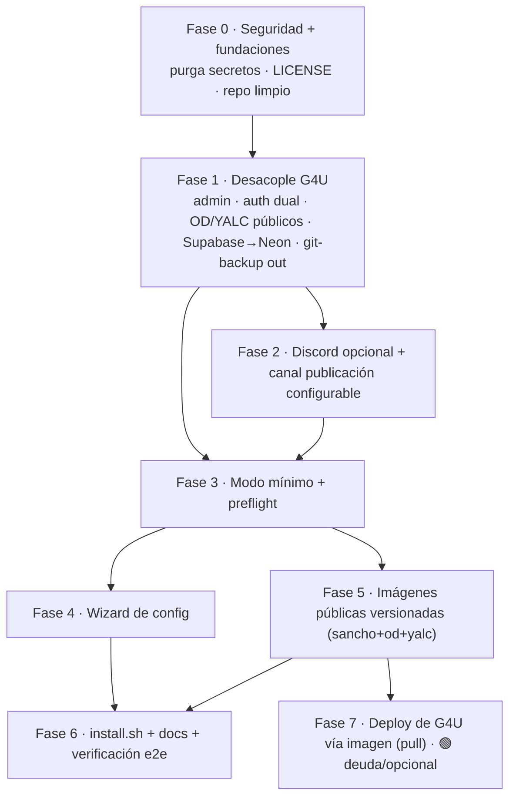

# Plan: paquetizar SanchoCMO como producto instalable por terceros

## Context

SanchoCMO hoy es una instancia operada por Growth4U sobre un repo privado + infra propia.
El objetivo es convertirlo en un **producto que cualquiera pueda descargar, configurar con un
paso simple y correr** (local o en su propio servidor), con updates triviales.

Decisiones del usuario (esta sesión):
1. Destinatario: **terceros / open source**.
2. **Discord ya no es interfaz**: la interacción es por Mission Control (chat web → Sancho).
3. Distribución: **híbrido** = imágenes Docker versionadas (núcleo) + instalador/wizard fino encima.
4. **OD y YALC deben venir de imágenes públicas** (resolver su publicación pública). Siguen siendo
   servicios opcionales (overlays), pero la imagen debe ser pública — no "bring your own build".
5. **Canal de publicación de crons**: hoy publican en Discord (y algunos en Slack). Hacerlo
   **configurable (slack|discord)**; si resulta muy complejo, **centralizar en Slack** (Slack ya
   tiene integración OAuth multi-tenant lista, ver `.env.example:61-71`, `src/pages/api/integrations/slack/`).
6. **Backups por git eliminados**: los datos de instancia ya tienen otro mecanismo de backup, así
   que se retira todo el flujo de "Cervantes hace git commit+push de backup".
7. **Supabase eliminado → Neon**: quitar toda referencia a Supabase (~44 archivos). `DATABASE_URL`
   ya apunta a Neon (`.env.example:34`).
8. **Auth de modelos dual**: tanto Anthropic como OpenAI deben poder usarse con **API key o con
   suscripción** (Anthropic: claude-cli; OpenAI: suscripción Codex). Hoy ambos están forzados a
   suscripción.

**Veredicto: factible, esfuerzo medio (~3–4 semanas ing. + 1 semana de prueba en infra limpia).**
La base es sólida (100% dockerizado, `release-please` ya versiona, separación framework/instancia
parcial vía `config/` gitignored + symlinks en `entrypoint.sh`, y `mc-chat → sancho` ya funciona sin
Discord). El trabajo es desacoplar de G4U, purgar secretos, hacer OD/YALC opcionales con imagen
pública, arreglar auth dual, retirar Discord/Supabase/git-backups, parametrizar canal de publicación,
añadir wizard y publicar imágenes. No es una reescritura.

---

## Progreso (tracking)

> Bitácora de avances. Última actualización: **2026-06-26**.

### ✅ Hecho

- **[2026-06-26 · Install local end-to-end + instalador sin-clone + CLI `./sancho`]** — la tanda 19→26-jun, toda **mergeada a `staging`**, cierra el camino de onboarding del producto:
  - **Instalador sin clonar el repo (`SAN-242`, #677)**: `get.sh` + tarball de runtime adjunto al release (en vez de exigir `git clone`) + fix de `OPENCLAW_HOME` + spec del instalador. El usuario instala desde un one-liner contra el artefacto del release, no contra el source tree.
  - **Onboarding local que realmente bootea** (sesión grande 25→26-jun, con mucho research/debug sin commit — boot loop, delivery 404 del chat, credencial sin cupo):
    - **Wizard recolecta TODAS las credenciales pre-boot (`SAN-331`, #889)**: sin placeholders rotos; preserva `config/clients.json` en `--force` (no rota el `adminToken` ni borra brands), reestructura modo→credencial, suma `fireworks`.
    - **Token de suscripción Anthropic unificado a `ANTHROPIC_OAUTH_TOKEN` (`SAN-332`, #891)**: una sola var de cara al usuario; `CLAUDE_CODE_OAUTH_TOKEN` queda como alias derivado solo para Discord/Cervantes.
    - **`mc-chat` apunta a Next `:3000` (`SAN-333`, #893 + follow-up #900)**: leftover de la migración MC→Next que mandaba el delivery al legacy `:18790` y lo rompía en local; el follow-up **migra** instalaciones ya existentes en el restart.
    - **`init-home` se auto-cura de un seed parcial (`SAN-329`, #894)**: copia atómica + merge no-clobber (`cp -an`) + limpieza de temps → un boot interrumpido ya no traba la install; se recupera al reiniciar.
  - **CLI `./sancho` unificado (`SAN-334`, #898)**: un solo comando para todo el ciclo de vida (`install/up/down/restart/update/logs/status/destroy`), lib compartida `scripts/compose-env.sh`, `install.sh` como shim, readiness real + URL al levantar, fix de overlays (solo los habilitados + `--remove-orphans`).
  - **Hardening de release/CI**: versionar el título del release PR agrupado para frenar el bloqueo recurrente de autorelease (`SAN-243`, #676); guard de `promote-main` contra tags fuera de staging + doc anti-tagueo-manual (`SAN-255`, #703); Dependabot con PRs agrupados por tipo de dependencia (`SAN-335`, #897); prune de planes aplicados/obsoletos en `docs/plans` (`SAN-253`, #700).
  - **Nota**: la credencial que falló en la prueba local fue la cuenta de Claude de G4U **sin cupo** (`out of extra usage`), no un bug de config.

- **[2026-06-18 · Branching/release cerrado + primera versión cortada + Fase 6 e2e ✅]** — varias piezas grandes:
  - **Modelo de branching/release (`SAN-230`) CERRADO** (ya no es bloqueante): `main` es **ff-only** (ruleset read-only `deletion+non_fast_forward+update+creation`, bypass solo del rol admin → el PAT de `promote-main`), **release-please corre sobre `staging`** (anclado con `last-release-sha` para que no se pierda con los tags en historia divergente), `main := staging` convergido, `main-old` + su ruleset eliminados. Reconciliación main↔staging hecha — el único delta real era el parse SSE de Alarife (#654). Docs (`CONTRIBUTING`, skill `git-workflow` con runbook de hotfix autónomo) al día.
  - **Primera versión del modelo nuevo cortada end-to-end: `v0.7.0`** — release-please sobre staging → `promote-main` ff de main → **`docker-image.yml` buildeó `ghcr.io/growth4u-systems/sanchocmo:v0.7.0`**. El pipeline nuevo funcionó por primera vez. (Salió 0.7.0 y no 1.0.0 por timing del merge de la release PR; el **1.0.0 se corta deliberado en Fase 0** como primer release público.)
  - **Fase 6 — e2e del producto DESDE LA IMAGEN ✅**: booteado `sanchocmo:v0.7.0` en workspace aislado (wizard non-interactive + `compose up`, sin source tree): **MC reachable** (`/`→200, `/api/health`→200), container **healthy**, **Postgres bundled migrado (22 tablas)**, auth `api_key` OK. El KPI core de Fase 6 (install → MC desde imagen) se cumple.
  - **Bug `api_key` (`SAN-235`, #663)** cazado por la Fase 6: el compose hardcodeaba `ANTHROPIC_API_KEY=` vacío (G4U-ism de subscription) y pisaba al `env_file` → el modo `api_key` del producto abortaba el preflight. Fix mode-aware (passthrough en compose + blanqueo en el branch subscription del entrypoint; G4U sin cambios).
  - **Build perf (`SAN-236`/`SAN-237`, #665/#670)**: build de imagen de **~40 min → ~6 min**. Causa: el arm64 corría emulado por QEMU. Fix: **multi-arch NATIVO** (amd64 en `ubuntu-latest` + arm64 en `ubuntu-24.04-arm`, en paralelo) — la org está en **GitHub Team**, que tiene runners arm64 nativos (verificado empíricamente). + registry cache en **package aparte** (`sanchocmo-buildcache`), provenance `mode=max` + SBOM (estándar supply-chain). Firma cosign diferida a Fase 0 (`SAN-240`).
  - **Nota gate de prod**: configurar required-reviewers en el environment `production` falló con un 422 de billing, pero la org **es Team** (que debería soportarlo) → re-chequear (anotado en `SAN-230`).

- **[Fase 1 · Admin configurable — GAP B1]** — PR [#208](https://github.com/Growth4U-systems/sanchocmo-openclaw/pull/208) (`feat/configurable-admin-domain` → `staging`), `Refs SAN-20`.
  - Nuevo `src/lib/data/admin-domain.ts` → `isAdminDomainEmail()` / `getAdminDomains()` (lee `ADMIN_EMAIL_DOMAIN`, lista por comas, tolera `@`).
  - Reemplazado el hardcode `@growth4u.io` en **todos** los gates: `nextauth.ts:79` (login) y `:45` (email del admin-token → `ADMIN_IDENTITY_EMAIL`), `admin-emails.ts`, `client-access.ts`, `users.ts`, `dashboard/admin/users.tsx`, `health-check.ts:323`.
  - `.env.example`: documentadas `ADMIN_EMAIL_DOMAIN` y `ADMIN_IDENTITY_EMAIL`.
  - UI (`dashboard/admin/users.tsx`): el chip resaltado `<code>` ahora muestra el/los dominio(s) configurado(s) vía `GET /api/admin/users` (nuevo campo `adminDomains`), con fallback si no hay ninguno.
  - Deploy: `deploy-staging.yml` y `deploy-prod.yml` inyectan las dos vars al `.env` (bloque `env:` + lista `KEYS` de `upsert-env.py`).
  - GitHub Environments seteados y verificados: `staging` y `production` → `ADMIN_EMAIL_DOMAIN=growth4u.io`, `ADMIN_IDENTITY_EMAIL=admin@growth4u.io` (preserva comportamiento actual, evita lockout).
  - Verificación local: `npm run typecheck` ✅ · `npm run test:lib` ✅ 36/36.

- **[Fase 1 · Auth de modelos dual — GAP C]** — PR [#219](https://github.com/Growth4U-systems/sanchocmo-openclaw/pull/219) (`feat/dual-model-auth` → `staging`), `Refs SAN-22`. Trabajado en worktree aislado.
  - `ANTHROPIC_AUTH_MODE` / `OPENAI_AUTH_MODE` (`api_key` default | `subscription`).
  - `generate-openclaw-config.js`: en `api_key` escribe perfil `anthropic:default` (`mode:"token"`, key del env); en `subscription`, `anthropic:claude-cli` (oauth). Limpia el perfil del modo contrario.
  - `entrypoint.sh`: gatea `sync-codex-auth.sh` y `ensure-anthropic-subscription-auth.js` al modo `subscription`; en `api_key` los saltea (usa `OPENAI_API_KEY`/`ANTHROPIC_API_KEY`).
  - `.env.example` + ambos deploy workflows (env block + KEYS).
  - GitHub Environments: `staging` y `production` → `ANTHROPIC_AUTH_MODE=subscription`, `OPENAI_AUTH_MODE=subscription` (preserva el comportamiento de G4U, evita flip de billing).
  - Verificación: `node --check` ✅ · `bash -n` ✅ · test funcional de la generación de config (ambos modos → bloque `auth` correcto, validado vs `openclaw.json.last-good`). **Pendiente:** inferencia real en runtime/container.

- **[Fase 1 · Supabase → Neon — GAP B6]** — PR [#318](https://github.com/Growth4U-systems/sanchocmo-openclaw/pull/318) (`chore/san-86-remove-supabase` → `staging`), `Refs SAN-86`. Trabajado en worktree aislado.
  - Persistencia ya corría en Neon (`DATABASE_URL`); esto elimina Supabase de toda la superficie funcional y shipped, sin cambio de comportamiento para G4U.
  - Código: `health-check.ts` (case + `ALL_SERVICES`), `api/clients/create.ts` (deja de copiar/escribir el bloque), `api/env/index.ts` (catálogo de APIs), `types/index.ts` (campo del tipo Client), `dashboard/guide.tsx` (Supabase → Neon en labels y FAQs), `workspace-sancho/scripts/mc-server.js` (server legacy arrancado por `docker/entrypoint.sh:264`: health-check + catálogo + mapeos).
  - Config/deploy: `instance.json.example`, `clients.json.example`, `.env.example` (sin `SUPABASE_*`), `deploy-staging.yml` + `deploy-prod.yml` (`SUPABASE_*` fuera del bloque `env:` y de `KEYS`).
  - Scripts: `new-client.sh` (elimina lectura de `instance.json`, el insert REST a Supabase y la **anon_key hardcodeada** — A6); `regenerate.py` (campo en `clients.js` legacy + keyword).
  - Docs/skills: README, runbook `system-keys-management.md`, onboarding/governance, `connect-api`, schemas de `acquisition-metrics-plan`. Eliminado `workspace-cervantes/supabase-migration.sql`.
  - Fuera de scope (documentado): archivos con secretos vivos + data histórica de runtime (Fase 0); el folder de Drive **"Supabase Recordings"** (nombre literal, no es la DB) se conserva.
  - Verificación local: `npm run typecheck` ✅ · `npm run test:lib` ✅ 162/162 · `node --check mc-server.js` ✅ · JSON examples válidos.

- **[Fase 1 · Retiro de git-backup — GAP B5]** — PR [#325](https://github.com/Growth4U-systems/sanchocmo-openclaw/pull/325) (`chore/san-90-remove-git-backup` → `staging`), `Refs SAN-90`. Trabajado en worktree aislado.
  - Retirado el backup diario de Cervantes (`git add -A` + commit + push de `~/.openclaw` a GitHub). Decisión #6: los datos ya tienen otro backup (data snapshots → `/mnt/data`).
  - `Dockerfile` (git config Cervantes), `docker-compose.yml` (mount `~/.ssh:ro`), `docker/crontab-cervantes` (cron 03:00), `workspace-sancho/scripts/backup.sh` (**eliminado**), `README.md` + `docs/DEPLOY.md` (menciones).
  - Fuera de scope: **data snapshots** (`snapshot-data.sh`, `/mnt/data`) se conserva — su opcionalización es F5. Snapshots/CHANGELOG históricos + `mc-data.js` (generado) sin tocar.
  - Verificación: `git grep` refs funcionales → 0 · `docker-compose.yml` YAML válido · una instalación nueva no sembraba el cron (no hay `cron/jobs.json` trackeado).

- **[Fase 1 · Open Design opcional — GAP B2/B4]** — PR #327 (`chore/san-91-od-optional` → base `chore/san-90-remove-git-backup`, **stacked**), `Refs SAN-91`. Trabajado en worktree aislado.
  - OD vivía en `docker-compose.yml` base con `OD_API_TOKEN:?` requerido → `compose up` fallaba sin OD. Ahora el base **levanta sin OD**.
  - Nuevo `docker-compose.od.yml` (overlay opt-in) con `open-design` (imagen pública `ghcr.io/growth4u-systems/od:edge`), volumen + `depends_on` + mount de design-systems (B4 sale del base). OD removido del base.
  - `deploy-staging.yml` + `deploy-prod.yml`: `ENABLE_OD_SERVICE` (default 1) suma `-f docker-compose.od.yml` en todos los `COMPOSE_ARGS` → G4U mantiene OD.
  - `.env.example`: OD documentado como overlay opt-in.
  - Verificación (`docker compose config`): base sin token ✅ · base+OD sin token falla (esperado) · base+OD con token ✅ · combo base+OD+YALC ✅ · deploy YAML válido.

- **[Fase 2 · Discord opcional — GAP D1/D2/D3]** — PR #329 (`chore/san-92-discord-optional` → base `chore/san-91-od-optional`, **stacked**), `Refs SAN-92`. Aclaración del usuario #1.
  - `docker/generate-openclaw-config.js` (D2): el bloque `channels.discord` se gatea a `DISCORD_BOT_TOKEN`; sin token Discord no se habilita (`mc-chat` sigue primario).
  - `.env.example` (D1): `DISCORD_BOT_TOKEN` comentado/opcional. `config/instance.json.example` (D3): bloque `discord` marcado opcional (`$comment_discord`).
  - G4U sin cambio (setea el token → rama con-token = comportamiento previo). Verif: `node --check` ✅ · JSON válido ✅ · test funcional del gating ✅.
  - **Follow-ups Fase 2**: ✅ D4 (retiro `new-client.sh`, SAN-108), ✅ D5 (canal publicación slack|discord), ✅ D6 (README→MC, SAN-92).

- **[Fase 4/6 · install.sh + wizard — E1/E2/E4]** — PR #331 (`chore/san-93-wizard-install` → base `chore/san-92-discord-optional`, **stacked**), `Refs SAN-93`. Aclaraciones #2 (wizard) y #4 (un comando).
  - `install.sh` (raíz): chequea docker/compose/openssl, corre el wizard si falta `.env`, `docker compose up -d --build`. Flags `--od`/`--yalc`/`--no-up`/`--force`.
  - `scripts/wizard.sh`: interactivo + no-interactivo (`WIZARD_ASSUME_YES=1`). Genera secrets (`NEXTAUTH_SECRET`/`ENCRYPTION_KEY`/`SANCHO_INTERNAL_API_TOKEN`/`adminToken`/`mcToken`) y escribe `.env` + `config/instance.json` (sin Discord) + `config/clients.json` (primer brand). No pisa sin `--force`. Checklist final E5.
  - `docs/INSTALL.md`: guía.
  - Verif: `bash -n` ✅ · wizard non-interactive genera archivos válidos (JSON OK, tokens 64 hex) · `docker compose config` con el `.env` generado ✅.
  - **Nota**: DB local setea `COMPOSE_PROFILES=local-db` — se enciende del todo con B9. Follow-up #2: preflight (Fase 3), SetupChecklist UI (E5).

- **[Fase 2 · Retiro de new-client.sh — GAP D4]** — PR #363 (`chore/retire-new-client` → `staging`, **no stacked** — el stack ya está en staging), `Refs SAN-108`. Trabajado en worktree aislado.
  - **Corrige el plan**: D4 pasa de "reescribir el script sin guild" a **retirarlo**. El onboarding ya no lo necesita: (1) el cliente se crea desde Mission Control (`api/clients/create.ts`: registra en `clients.json` + carpeta base, sin Discord/Supabase); (2) Sancho corre Fast/Full Foundation por chat y las skills se auto-bootstrappean — el `foundation-orchestrator` crea `foundation-state.json` v3.0 si no existe, cada skill crea su sub-árbol. El script era el camino viejo (pre-seed + `--guild` obligatorio + insert Supabase), redundante.
  - **Eliminado** `workspace-sancho/scripts/new-client.sh`. Removido el endpoint legacy `POST /api/new-client` (que lo ejecutaba vía SSE) de `mc-server.js` (gateway legacy **vivo** en :18790) y `legacy-mc-server.js` (muerto), + var huérfana `_clientCreationInProgress`.
  - Docs al flujo nuevo: `README.md`, `_system/onboarding/{new-client-protocol,client-onboarding}.md` (reescritos), `foundation-threads/SKILL.md`, mensajes de error en `setup-content-engine-crons.sh` + `reseed-foundation.sh`.
  - Fuera de scope: docs internos de Cervantes (se limpian en su track de retiro); `CHANGELOG.md` histórico; **`mc-server.js` sigue necesario** (fallback Strangler-Fig, el Next aún proxya `recurring-tasks`/`connect-proxy` a :18790).
  - Verif: `node -c` ambos servers ✅ · `grep new-client` en código → 0.

- **[Fase 1.5 · Postgres bundled — GAP B9]** — PR [#366](https://github.com/Growth4U-systems/sanchocmo-openclaw/pull/366) (`feat/pg-bundled-local-db` → `staging`) **MERGED 2026-06-09**, `Refs SAN-110`. Worktree aislado. Enfoque aprobado por el usuario: **driver condicional + baseline limpio + migrate-at-boot, gateado a local-db; path Neon de prod byte-idéntico**.
  - **Driver condicional**: nuevo `src/db/driver-select.ts` → `selectDbDriver(url, override)` (auto: `*.neon.tech` → `neon`, otro → `postgres`; override `DATABASE_DRIVER`). `src/db/drizzle.ts` instancia `neon-http` o `postgres-js` según eso; `Db` se tipa como el cliente neon histórico (cast en el boundary) → **cero churn en call-sites**. Dep nueva: `postgres` (postgres.js).
  - **Baseline limpio**: las migraciones de `src/db/migrations/` están rotas para replay (sin journal, números duplicados, `0003_rekey_tasks` con DROP). Nuevo `drizzle.local.config.ts` + `src/db/migrations-local/` (baseline `0000` consolidado desde `schema.ts`, 22 tablas, sin DROPs, con journal). Prod/Neon sigue con su flujo manual aparte.
  - **Migrate-at-boot**: `scripts/migrate-local.mjs` (migrator programático postgres-js, espera readiness, idempotente, no-op en Neon, non-fatal). Gateado en `docker/entrypoint.sh` (sección 5d, solo si driver=postgres y `DATABASE_URL` seteada). `COPY` agregado en `Dockerfile`.
  - **Compose**: servicio `postgres:16-alpine` detrás del profile `local-db` + volumen `postgres_data` + healthcheck; `DATABASE_DRIVER` passthrough. `.env.example` y `docs/INSTALL.md` (nueva sección *Database*) documentan modo bundled vs externo vs sin-DB, auto-detect del driver, y migraciones auto al boot.
  - **Seguridad prod**: `DATABASE_DRIVER=neon` explícito en `deploy-staging.yml` + `deploy-prod.yml` (cinturón sobre el auto-detect).
  - **Resuelve la decisión abierta #5** (driver + bootstrap). El `.batch()` neon-only de `client-lifecycle.ts` se hizo portable (neon mantiene `.batch`; postgres usa transacción interactiva) — único call-site con divergencia real.
  - **Fuera de scope**: cutover de tasks a DB (B8) — `MC_TASKS_BACKEND` queda en `json`; B9 solo habilita MI/POV/Polar con DB local.
  - Verificación: `npm run test:lib` ✅ 192/192 (incluye 5 nuevos de `selectDbDriver`) · `npm run typecheck` ✅ · `docker compose config` base (sin postgres) y `--profile local-db` (con postgres+volumen) ✅ · **bootstrap real contra `postgres:16-alpine` efímero**: 22 tablas, idempotente, URL neon → skip ✅ · **e2e sobre la red de compose** (servicio `postgres` healthy vía profile, migrate por nombre de host → 22 tablas, persistencia del volumen al recrear) ✅.

- **[Fase 4/6 · Fix wizard `.env` duplicado — B9 follow-up]** — PR [#367](https://github.com/Growth4U-systems/sanchocmo-openclaw/pull/367) (`fix/wizard-env-dup-database-url` → `staging`), `Refs SAN-110`. **MERGED 2026-06-09.**
  - **Regresión que B9 metió en staging**: el bloque DB de `.env.example` documentaba el modo bundled con ejemplos comentados `DATABASE_URL=…`. El `set_env()` del wizard matchea `^#?\s*KEY=` y reemplazaba el **primer** match (el ejemplo comentado), dejando dos `DATABASE_URL` activos → en `env_file` de compose gana el último (`CHANGE_ME`) → la app no conecta al PG bundled.
  - Fix: reescritos los comentarios para que **no contengan la forma `KEY=`** (un solo target de `set_env`) + `NOTE` documentando el gotcha.
  - Verificado: el wizard emite **un solo** `DATABASE_URL` activo; boot real local-db OK (22 tablas).

- **[Fase 6 / GAP G · Imagen self-contained — seed de OPENCLAW_HOME]** — PR [#369](https://github.com/Growth4U-systems/sanchocmo-openclaw/pull/369) (`chore/self-contained-image-seed` → `staging`), `Refs SAN-111`. **MERGED 2026-06-09.** Trabajado en worktree aislado.
  - **Problema** (descubierto en el primer boot real del producto): un `OPENCLAW_HOME` vacío crasheaba (`Cannot find module '/root/.openclaw/docker/generate-openclaw-config.js'`) — el Dockerfile no bakeaba nada del "openclaw-home"; el contenido venía del repo montado. El producto no puede depender de tener el repo clonado en una ruta específica.
  - **`.dockerignore` (nuevo)**: el `COPY` del seed honra `.dockerignore` (no `.gitignore`) → excluye data/runtime/junk para que **no se baken datos de cliente** (`_backups/` con `hospital-capilar-backup`, `memory/`, `brand/`, `_system/recurring-tasks/`, logs, `.pyc`, `.backup*`, cron pre-backups).
  - **`Dockerfile`**: bakea el framework a `/opt/sancho-seed/` (path que el mount no shadowea) + `.seed-version`.
  - **`docker/init-home.sh` (nuevo)**: cada boot refresca `skills/docker/plugins` desde la imagen (gateado por version marker → sin churn de 180MB; preserva `plugins/installs.json`) y seedea `agents/workspace-*/config/cron` **solo si faltan** (nunca pisa datos). Invocado al inicio del `entrypoint.sh`.
  - **Seguridad G4U**: default del compose `${OPENCLAW_HOME:-~/.openclaw}` **sin tocar** (G4U depende de que resuelva a su repo); en su volumen poblado init-home **sí corre** pero es idempotente (refresh = mismos bytes del commit deployado) + seed-if-absent no-op → datos intactos. Primer boot post-merge: copia única de ~180MB del framework, luego version-gated.
  - Verificado (boot real aislado): **`OPENCLAW_HOME` vacío bootea** (sin crash) → gateway ready + Next + healthy + 22 tablas; datos preservados en restart (sentinel + config); refresh version-gated ("skipping refresh"); **sin datos de cliente en el seed** (grep).
  - **Resuelve GAP G** (que `compose pull` no pise datos del volumen) — ver sección G.

- **[Stack 2026-06-09 mergeado]** — #367 (fix wizard `.env` dup), #369 (imagen self-contained / GAP G) y #372 (D5 canal publicación Slack + UI) **MERGED a `staging`**. La sección "En curso" previa quedó saldada.

- **[Fase 1/5 · YALC imagen pública — GAP B3 (parcial)]** — `Refs SAN-135`. Decisión de arquitectura confirmada (`SAN-21`): **sidecar, NO embed** — el agente Yalc se fusionó en Rocinante (#391) pero el **servicio** GTM-OS (`:3847`) sigue siendo el motor de Outreach (cliente `src/lib/yalc/client.ts` + ~20 rutas `api/yalc/*` + cockpit `yalc.tsx`). Por eso no se dropea: se publica como imagen.
  - **[Yalc-Growth4U PR #18 — MERGED]**: nuevo `.github/workflows/docker-image.yml` (espejo de `open-design`) → publica `ghcr.io/growth4u-systems/yalc` multi-arch (`:edge` en main, `:vX.Y.Z`+`:latest` en tags). El repo sigue privado; la **imagen ya es pública** ✅ (2026-06-11).
  - **[sanchocmo PR #416 — MERGED + VERIFICADO EN STAGING 2026-06-11]** (commit `8910386`): `docker-compose.yalc.yml` `build: ../Yalc-Growth4U` → `image: ${YALC_IMAGE:-ghcr.io/growth4u-systems/yalc:edge}`; deploys sin clone del repo privado (fuera `YALC_BUILD_CONTEXT`/`YALC_REF`/`YALC_REPO_TOKEN`), `pull --ignore-buildable` ya existente refresca; `.env.example` documenta `YALC_IMAGE`. ✅ Verificado en el VPS de staging: container `yalc-gtm-os` corre de `ghcr.io/growth4u-systems/yalc:edge` (antes build local `openclaw-yalc`), healthy, `:3847/health → 200`; digest del container == registry público (`sha256:1a66e0a1…`). Último deploy a staging verde.

- **[Fase 4 · Wizard conecta YALC — GAP E (cierre)]** — PR #418 (`Refs SAN-136`) **MERGED**. El wizard tenía un hueco: mencionaba YALC pero no generaba el token ni cableaba la URL (síntoma de `SAN-131`, "Yalc no conectado"). Ahora `scripts/wizard.sh` tiene paso `6/6 Outreach` opcional → genera `YALC_API_TOKEN` + `YALC_BASE_URL=http://yalc:3847`; `install.sh` levanta el overlay automáticamente si el wizard lo provisionó. Verificado non-interactive (enabled/disabled).

- **[Fase 3 · Preflight de boot — GAP E3]** — PR #422 (`Refs SAN-138`) **MERGED**. Nueva sección `0c` en `docker/entrypoint.sh`: valida `NEXTAUTH_SECRET`, `ENCRYPTION_KEY`, `config/clients.json`+`instance.json` (existen + JSON válido), ≥1 credencial de modelo según `*_AUTH_MODE`, y `DATABASE_URL` solo si `MC_TASKS_BACKEND`∈{db,db-shadow}. Lista todos los faltantes + fix y aborta; `SKIP_PREFLIGHT=1` saltea. G4U pasa sin cambios (verificado contra el env real de staging). `bash -n` + 13 escenarios en sandbox.

- **[Fase 5 · Imagen pública de `sanchocmo` + workflow GHCR + compose `image:`]** — PR [#428](https://github.com/Growth4U-systems/sanchocmo-openclaw/pull/428) (`Refs SAN-140`) **MERGED 2026-06-10**. Es EL mecanismo "compose pull". Decisión de arquitectura confirmada con el usuario: **`image:`+`build:` en el base** (no overlay separado) + **publish en release/edge/manual, multi-arch**.
  - **Nuevo `.github/workflows/docker-image.yml`** (espejo de OD/YALC): publica `ghcr.io/growth4u-systems/sanchocmo` multi-arch (`linux/amd64,arm64`) → `:vX.Y.Z`+`:latest` en `release: published` (engancha a release-please), `:edge` en push a `staging`, `workflow_dispatch` (input `tag`, default `edge`) para publicar privado on-demand. `cache-from/to: gha`, pasa `GIT_COMMIT=${github.sha}`, honra `.dockerignore` (el `context: .` no rebaka data de cliente, ver #369).
  - **`docker-compose.yml`**: `sanchocmo` gana `image: ${SANCHOCMO_IMAGE:-ghcr.io/growth4u-systems/sanchocmo:latest}` **conservando `build:`**. Compose tagea el build local con ese mismo `image:` → ambos caminos convergen. **Cero cambios a los deploy workflows de G4U**: su `build --pull` sigue construyendo local, y `pull --ignore-buildable` saltea sanchocmo (tiene `build:`) → nunca pullea imagen ajena.
  - **`install.sh`**: el path producto hace `compose pull` (best-effort) antes de `up -d` (sin `--build`); si el pull falla (package privado/offline) `up -d` cae a build desde el source tree (tiene `build:`). Nuevo flag `--build` fuerza build desde clone. Mensaje de update = `pull && up -d`.
  - **`.env.example`**: sección *Distribution / core image* documenta `SANCHOCMO_IMAGE` (pin de versión). **`docs/INSTALL.md`**: sección *Updating* reescrita a `pull && up -d` (sin `git pull`/rebuild) + pin + nota de build-desde-clone. **`docs/DEPLOY.md`**: nota en *Launch* ofreciendo el path imagen pública como alternativa al `--build`.
  - **Push público gateado por Fase 0** (la imagen self-contained bakea el framework con refs/data de cliente); hasta entonces el package se publica **privado** para probar el mecanismo. El workflow funciona igual para hosts autenticados a GHCR.
  - Verificación: `bash -n install.sh` ✅ · YAML del workflow parsea (3 triggers, 6 steps) ✅ · `docker compose config`: base con `image:`+`build:` ambos presentes ✅, default `:latest` y `SANCHOCMO_IMAGE` override ✅, overlays od+yalc válidos ✅, `--ignore-buildable` saltea sanchocmo (buildable) ✅. **Pendiente** (post-merge): primer push real del package (queda **privado** hasta Fase 0) + e2e `compose pull` en host limpio (Fase 6).
  - **🔗 Cruza con el track de branching/release** ([`branching-release-model-proposal.md`](./branching-release-model-proposal.md)): ese `docker-image.yml` se dispara en `release: published`, que en el modelo nuevo lo corta **release-please sobre staging** (tag `:vX.Y.Z` desde staging). El packaging plan **consume** ese artefacto; la maquinaria que lo **produce** es la propuesta de branching. Ver "Dependencia con el modelo de branching/release" abajo.

- **[Fase 3/D7 · Degradación graceful Outreach (YALC) — parcial]** — PR #420 (`Refs SAN-137`) **MERGED** (commit `68fee290`, 2026-06-10). `isYalcConfigured()` en `client.ts` distingue "no activado" de "caído"; `overview.ts` devuelve `configured`; `yalc.tsx` muestra placeholder "Outreach no está activado" con CTA en vez del cockpit roto. `docs/INSTALL.md`: sección Outreach + conectar proveedor de email. **Falta el equivalente para OD** (D7-OD).

- **[Fase 2 · README → Mission Control — GAP D6]** — `Refs SAN-92`. Reescrito `README.md` alrededor de Mission Control (chat web → Sancho) en vez de Discord: tagline ("operated through Mission Control"), diagrama de arquitectura (entrada = MC chat; Discord/Slack = canales opcionales), columna "How it activates" de los agentes (Mission Control chat, no "Discord messages"), sección Multi-Client (cliente = brand en MC, no "1 Discord guild"), Quick Start reescrito al flujo `install.sh` + wizard (Discord/OD/YALC opcionales), y sección Mission Control actualizada al server Next.js (`:3000`, no el legacy `mc-server.js:18790`). **Fuera de scope** (anotado): el roster de agentes tiene drift aparte de Discord (Escudero retirado en SAN-104; agentes nuevos dulcinea/hamete/mambrino/merlin) — no se toca acá, es otro cambio.

- **[Fase 1 · LICENSE final (SUL) — GAP B7]** — PR de esta tanda (`Refs SAN-94`). `LICENSE.md` pasa de **DRAFT** a **Sustainable Use License** canónica (texto estilo n8n adaptado): licensor **Growth4U Systems**, *Permitted Purpose* = uso interno de negocio / personal, con la restricción de **no** ofrecerlo como servicio hosted comercial competidor; cláusulas de trademarks / patentes / disclaimer de garantía. Decisión del usuario (esta sesión): source-available, **no** OSI-open-source. Banner DRAFT removido. El README ya enlazaba `[Sustainable Use License (SUL)](LICENSE.md)`.

### 🟡 En curso / bloqueado

- **✅ Visibilidad de imágenes GHCR — `yalc` y `od` PÚBLICOS (2026-06-11)**: verificado por pull anónimo a GHCR sin creds — ✅ **`yalc`** (`:edge` → `HTTP 200`) y ✅ **`od`** (`:edge` → `HTTP 200`), ambos pullables anónimo → **desbloquean #416** y dejan a OD ya no dependiente de la cache local del VPS. (`:latest` da `404` en ambos porque solo se publica `:edge`, sin release tagueado aún — esperado.) Contexto histórico (2026-06-10, ya resuelto): OD corría en staging solo por cache local de un pull viejo porque la credencial ghcr del VPS es un placeholder roto; ahora con la imagen pública el pull anónimo funciona.
- ✅ **PR #416 — MERGED + VERIFICADO EN STAGING** (2026-06-11, commit `8910386`): YALC ya corre en staging desde la imagen pública (`ghcr.io/growth4u-systems/yalc:edge`, healthy, digest == registry), deploy verde.
- ✅ **PR #420 MERGED** (D7-YALC, `68fee290`): degradación graceful de Outreach ya está en `staging`. Pendiente solo el espejo para OD (D7-OD).
- ✅ **Fase 5 mergeada — PR #428 MERGED** (2026-06-10, `SAN-140`): el mecanismo "compose pull" (`docker-image.yml` + base con `image:`+`build:` + `install.sh` pull-first) está en `staging`. **Toda la ingeniería de Fases 1–5 está mergeada.** Lo único que falta para publicar es destrabar **Fase 0**; luego el primer push real del package (hasta entonces, privado) + e2e en host limpio (Fase 6).
- **🔴 Fase 0 = ÚNICO bloqueante restante para publicar** — confirmado 2026-06-16 (`git ls-files`): siguen trackeados con secretos vivos `sancho-cmo.taild48df2.ts.net.key` (clave TLS privada de Tailscale), `.env.bak-1778520082`, `.env.local.bak-1778526782`, `.mc-proxy-device.json`, `openclaw.json.last-good`, `workspace-sancho/_system/instance.json`. Además el seeding (#369) dejó **más expuesto** el repo: commitea **data operacional y refs hardcodeadas de G4U** que el `.dockerignore` (safety net) no cubre del todo: `workspace-sancho/scripts/{regenerate.py,mc-server.js,auto-bind.py,create-client-crons.sh}` (+ `.backup*`), `mc-data.js`/`legacy-*.js`, `_system/intelligence-log.json`, `AGENTS.md`, etc. mencionan slugs de clientes reales. **La imagen de Sancho NO es publicable hasta la purga Fase 0** (la imagen self-contained bakea el framework). Es **destructiva** (rewrite de historial + rotación de credenciales) → la ejecuta Nahuel.

### ⏭️ Próximo

> Estado (2026-06-26): el producto **levanta local sin G4U**, **bootea desde la imagen versionada** (`sanchocmo:v0.7.0`, Fase 6 ✅) y ahora **se instala sin clonar el repo** (`get.sh` + tarball de release, `SAN-242`) y se opera con el **CLI `./sancho`** (`SAN-334`). El onboarding local end-to-end quedó cerrado (wizard recolecta todas las credenciales pre-boot `SAN-331`, auth Anthropic unificada `SAN-332`, `mc-chat`→Next `SAN-333`, `init-home` self-heal `SAN-329`). El **modelo de branching/release está cerrado** (`SAN-230`) y ya cortó la primera versión end-to-end. **El único bloqueante de fondo para publicar es Fase 0** (la purga — destructiva, la ejecuta Nahuel). Después: cortar **v1.0.0** como primer release público + e2e con el package público (`compose pull` anónimo). El resto es pulido (E5, D7-OD) y deuda no bloqueante (Fase 7, GAP H, B8). Re-chequear el gate de prod (required reviewers, 422 de billing — la org es Team).

**Bloqueado en el usuario:**
- **Fase 0** (purga de secretos + data/refs de cliente; rewrite de historial + rotación) — **único bloqueante restante** para publicar el repo **y** la imagen de Sancho. Destructivo → lo ejecuta Nahuel. (Ya arrancó: `SAN-233` destrackeó secretos y gitignoreó backups en staging — falta el rewrite de historial + rotación.)
- ~~**Decisión del modelo de branching/release**~~ → ✅ **HECHO (`SAN-230`, 2026-06-18)**: `main` ff-only + release-please sobre `staging` + reconciliación main↔staging, **v0.7.0 cortada end-to-end** (maquinaria que produce los `:vX.Y.Z`). El gate de prod (required reviewers) quedó pendiente por un 422 de billing a re-chequear (la org es Team).
- ~~Hacer públicos los packages `yalc` + `od`~~ → ✅ **HECHO + verificado 2026-06-11** (pull anónimo `:edge` → 200; #416 mergeado y verificado en staging).
- ~~**B7**: texto final de la LICENSE~~ → ✅ **HECHO** (SUL canónica, `SAN-94`).

**Desbloqueado (ingeniería, se puede avanzar ya):**
- **E5** — Setup Checklist UI en el dashboard ("qué falta configurar").
- **D7-OD** — placeholder graceful de Open Design sin daemon (espejo de lo hecho para YALC en #420).
- ~~**Fase 6 — verificación e2e en máquina limpia**~~ → ✅ **HECHO (2026-06-18)**: producto booteado **desde la imagen `sanchocmo:v0.7.0`** (no source) en workspace aislado — MC reachable + healthy + PG bundled 22 tablas + auth api_key. Cazó el bug `SAN-235`. Falta solo el e2e con el package **público** (`compose pull` anónimo) → gateado por Fase 0; y opcionalmente el path de update (`pull && up -d` preserva data).

> ~~Fase 5 / #428~~ ✅ **MERGED** · ~~D6 README~~ ✅ HECHO (`SAN-92`).

**Deuda / opcional (no bloquean lanzamiento):**
- **Fase 7 — deploy de G4U vía imagen (pull en vez de build)**: hoy el VPS buildea desde source; migrarlo a `compose pull` de la imagen que publica el CI (Fase 5). Beneficio: deploy en segundos, menos RAM/disco en VPS, paridad byte-idéntica staging→prod, dogfooding. **No bloqueante**; ver sección dedicada abajo (3 pre-requisitos).
- **GAP H (`SAN-109`)**: terminar Strangler-Fig, dejar de levantar `mc-server.js` (`:18790`).
- **B8**: cutover tasks JSON→DB (runbook + ejecución del usuario). El producto corre con `json` igual.

---

## 🤖 Modo autónomo (sesión 2026-06-05)

> El usuario dejó la sesión corriendo sola con instrucción de avanzar lo máximo posible. Estrategia:
> **PRs apilados (stacked)** en orden de dependencia (uno por concern, base = branch anterior), porque
> nadie va a mergear mientras tanto. Cada item se testea antes del PR. La meta prioritaria es que el
> proyecto **levante localmente** (`docker compose up`) sin G4U: PG bundled + Discord opcional + modo
> mínimo + wizard + install. Bitácora y preguntas abiertas abajo.

### Aclaraciones del usuario (2026-06-05)

1. **Discord = una opción más de comunicación, igual que Slack.** No debe ser fundamental para que la app
   funcione, ni los clientes deben estar ordenados en torno a Discord. (Refuerza Fase 2 / GAP D.)
2. **El wizard de config debe ser lo más completo, intuitivo y eficiente posible.** (Fase 4 / E.)
3. **Las imágenes de OD y YALC ya deberían ser públicas — las arma G4U.** → **B2/B3 desbloqueado**
   (no hay blocker de derechos de publicación; solo referenciar las imágenes públicas correctas).
4. **Instalar el producto con un comando** (o lo más cercano posible): `install.sh` / one-liner. (Fase 6.)

### Bitácora autónoma (orden cronológico de PRs en el stack)

| # | Item | PR | Estado | Notas |
|---|------|----|--------|-------|
| 1 | B5 · retiro git-backup | #325 (base `staging`) | ✅ abierto | base del stack |
| 2 | B2 · OD opcional (overlay) | #327 (base #325) | ✅ abierto | imagen OD ya pública `ghcr.io/growth4u-systems/od:edge` |
| 3 | D1-D3 · Discord opcional | #329 (base #327) | ✅ abierto | aclaración #1; D4/D5/D6 follow-up |
| 4 | Fase 4/6 · install.sh + wizard | #331 (base #329) | ✅ abierto | un-comando install; DB local ✅ con B9 |
| 5 | B7 · LICENSE.md (borrador) | #333 (base #331) | ✅ mergeado | placeholder SUL; **finalizado** luego a SUL canónica (`SAN-94`) |
| 6 | B9 · Postgres bundled (driver condicional + baseline) | #366 (→ `staging`), SAN-110 | ✅ **MERGED** (2026-06-09) | resuelve decisión #5; e2e en container + persistencia de volumen ✅ |
| 7 | Fix wizard `.env` duplicado (B9 follow-up) | #367 (→ `staging`), SAN-110 | ✅ **MERGED** (2026-06-09) | regresión de B9 en staging; mergeado antes de #369 |
| 8 | Imagen self-contained (seed OPENCLAW_HOME) — GAP G | #369 (→ `staging`), SAN-111 | ✅ **MERGED** (2026-06-09) | volumen vacío bootea; datos preservados |

### ❓ Preguntas abiertas para el usuario (responder al volver)

1. **✅ LICENSE (B7) — RESUELTO** (`SAN-94`): el usuario eligió **Sustainable Use License** (esta sesión). `LICENSE.md` finalizado con texto SUL canónico (licensor Growth4U Systems, Permitted Purpose = uso interno/personal, no resale-as-hosted-service), banner DRAFT removido. *(Recomendado igualmente: revisión legal antes del release público.)*
2. **Imágenes públicas OD/YALC (B2/B3/F5)** — ✅ **RESUELTO + VERIFICADO 2026-06-11**: **`yalc` y `od` ya son públicos** (pull anónimo `:edge` → `HTTP 200` en ambos). El cutover del overlay YALC (**#416**) está **mergeado y verificado en staging**: el container `yalc-gtm-os` corre de `ghcr.io/growth4u-systems/yalc:edge`, healthy, digest == registry público. OD ya no depende de la cache local del VPS.
3. **Fase 0 (purga de secretos)** — bloqueante para publicar, **destructivo**: rewrite de historial git + **rotar** credenciales expuestas (clave Tailscale `sancho-cmo.taild48df2.ts.net.key`, tokens de `openclaw.json.last-good`/`.env.bak`/`instance.json`). **No lo hago solo.** Lo ejecutás vos.
4. **Cutover tasks JSON→DB (B8)**: requiere `db-shadow` en staging N días con diff continuo antes del cutover. Autónomamente solo el **runbook**; el cutover lo hacés vos.
5. **✅ B9 (Postgres bundled) — RESUELTO** (branch `feat/pg-bundled-local-db`). El usuario aprobó el enfoque **(i)**: driver condicional (`neon-http` para `*.neon.tech` / `postgres-js` para el resto) + baseline limpio generado desde `schema.ts` en `src/db/migrations-local/` + migrate-at-boot gateado a local-db. Prod/Neon byte-idéntico (auto-detect + `DATABASE_DRIVER=neon` en deploys). Verificado contra `postgres:16-alpine` (22 tablas, idempotente). Ver entrada en "✅ Hecho". El texto original de la decisión queda abajo como referencia histórica.
   <details><summary>Contexto original de la decisión</summary>

   **🔴 B9 (Postgres bundled) — DECISIÓN NECESARIA, bloquea local-run completo**: el driver de DB es `@neondatabase/serverless` (`neon-http`), que **NO habla con un Postgres vanilla** — solo con el endpoint HTTP de Neon. Para PG bundled hay que (a) cambiar/condicionar el driver (neon-http para Neon, `pg`/node-postgres para local) **sin romper la conexión Neon de G4U en prod**, y (b) resolver el bootstrap de schema: **no hay journal de Drizzle** (`migrations/meta/` ausente) → `drizzle-kit migrate` no sirve as-is; hay una migración **destructiva** (`0003_rekey_tasks`, DROP) y números duplicados → no se puede aplicar todo el SQL a ciegas; `apply-sql-migration.mjs` también usa `neon()`. **Opciones**: (i) generar un journal de Drizzle limpio desde el schema actual + driver condicional + migrate-al-boot solo para PG local; (ii) un `init.sql` consolidado para DBs frescas. Necesito tu OK sobre el enfoque (riesgo de tocar el path de DB de prod). El wizard ya deja `COMPOSE_PROFILES=local-db` listo para cuando aterrice. **Mientras tanto la app corre con `MC_TASKS_BACKEND=json` (default) o DB externa (Neon).**
   </details>

---

## Shape del cambio

```
HOY (acoplado a G4U, no distribuible)            OBJETIVO (producto)
─────────────────────────────────────           ─────────────────────────────
git clone privado + compose build                docker compose pull (imágenes
OD obligatorio (imagen privada, falla              públicas versionadas vX.Y.Z)
  sin OD_API_TOKEN)                               OD/YALC = overlays opt-in, img pública
YALC build desde ../Yalc-Growth4U (privado)       auth: API key (default) o suscripción
auth forzada a suscripción (Anthropic+OpenAI)       (switch env, Anthropic + OpenAI)
admin = @growth4u.io hardcode                     admin = ADMIN_EMAIL_DOMAIN
Discord MUST + guild-por-cliente                  MC chat interfaz primaria
crons publican en Discord (IDs hardcodeados)      publish channel configurable (Slack default)
Cervantes hace git backup (commit+push)           backup externo (git-backup retirado)
Supabase (anon/service keys)                      Neon (DATABASE_URL)
secretos commiteados en git                       repo limpio, sin secretos
```

### Orden de dependencias entre fases



---

## GAP detallado

### A. Seguridad del repo — 🔴 BLOQUEANTE #1

Secretos vivos commiteados (verificado con `git ls-files`). No basta `.gitignore`: hay que reescribir
historial o partir de un repo nuevo, y **rotar** las credenciales expuestas.

| # | Archivo trackeado | Riesgo |
|---|-------------------|--------|
| A1 | `sancho-cmo.taild48df2.ts.net.key` | **Clave privada TLS de Tailscale** |
| A2 | `.env.bak-1778520082`, `.env.local.bak-1778526782` | Backups de `.env` con API keys reales |
| A3 | `openclaw.json.last-good` (84 KB) | Config OpenClaw con tokens de gateway/auth |
| A4 | `workspace-sancho/_system/instance.json` | Instance real (Supabase service_key, Discord IDs, cuentas) |
| A5 | `.mc-proxy-device.json` | Device auth del proxy MC |
| A6 | `new-client.sh:858` | **Supabase anon_key hardcodeada** dentro del script |
| A7 | `workspace-cervantes/supabase-migration.sql`, `*.bak` en skills, `workspace-cervantes/.env.example` | Auditar por valores reales |

### B. Acoplamiento a Growth4U — 🔴 bloqueante

| # | Actual | Ideal | Dónde |
|---|--------|-------|-------|
| B1 ✅ | Admin gate real es `email.endsWith("@growth4u.io")` en el callback de auth | Helper `isAdminEmail()` que lea `ADMIN_EMAIL_DOMAIN` (+ `adminEmails`) | **HECHO** (PR #208) — `admin-domain.ts` + reemplazos en `nextauth.ts:79/:45`, `users.ts`, `admin-emails.ts`, `client-access.ts`, `dashboard/admin/users.tsx`, `health-check.ts:323` |
| B2 ✅ | **Open Design es obligatorio**: en `docker-compose.yml` base con `OD_API_TOKEN: ${OD_API_TOKEN:?...}` → `compose up` falla sin OD | **HECHO** (PR SAN-91): movido a overlay `docker-compose.od.yml` (imagen pública `ghcr.io/growth4u-systems/od:edge`); OD fuera del base → levanta sin OD; deploy G4U lo mantiene vía `ENABLE_OD_SERVICE` | `docker-compose.od.yml` (nuevo), `docker-compose.yml`, deploy workflows, `.env.example` |
| B3 ✅ | YALC build desde repo privado `../Yalc-Growth4U` | **HECHO** (`SAN-135`): workflow de imagen en `Yalc-Growth4U` (#18, **merged** → `ghcr.io/growth4u-systems/yalc:edge`, **package público 2026-06-11**) + overlay `build:`→`image:` y deploys (**#416 MERGED + verificado en staging**: `yalc-gtm-os` corre de la imagen pública, healthy, digest == registry). Decisión `SAN-21`: sidecar, no embed | `docker-compose.yalc.yml`, deploys, `Yalc-Growth4U/.github/workflows/docker-image.yml` |
| B4 | Volumen monta `brand/growth4u/...` hardcodeado | Va con overlay OD; parametrizar por brand o quitar del base | `docker-compose.yml:108` |
| B5 ✅ | **Git backups de Cervantes** (git config + daily commit+push) | **HECHO** (PR #325, SAN-90): quitado `git config` (Dockerfile), mount `~/.ssh` (compose), cron `backup.sh` (`crontab-cervantes`), `backup.sh` eliminado, menciones en README + DEPLOY.md. Data snapshots (`/mnt/data`) se conserva → F5 | `Dockerfile`, `docker-compose.yml:18`, `docker/crontab-cervantes`, README, DEPLOY.md |
| B6 ✅ | **Supabase** en ~44 archivos | **HECHO** (PR #318, SAN-86): eliminado de `instance.json.example`, `clients.json.example`, `new-client.sh` (insert + anon_key A6), `health-check.ts`, `api/clients/create.ts`, `api/env/index.ts`, `types/index.ts`, `guide.tsx`, `mc-server.js` (legacy live), `regenerate.py`, `.env.example`, ambos deploy workflows, docs/skills; borrado `supabase-migration.sql`. Persistencia = Neon (`DATABASE_URL`). Resto = data histórica/secretos (Fase 0) + folder Drive "Supabase Recordings" | grep `supabase` (44 files) |
| B7 ✅ | Falta `LICENSE.md` (README lo cita); docs usan `sanchocmo.ai`/IPs | **HECHO** (`SAN-94`): `LICENSE.md` = Sustainable Use License canónica (licensor Growth4U Systems, Permitted Purpose, sin resale-as-service); DRAFT removido. Pendiente aparte: placeholders `sanchocmo.ai`/IPs en `docs/` | raíz, `docs/` |

### C. Auth de modelos (Anthropic + OpenAI) — ✅ HECHO (PR #219)

El camino de **API key está roto hoy** para ambos proveedores:
- Anthropic: `generate-openclaw-config.js:40-46` borra `anthropic:default` y fuerza `anthropic:claude-cli` (oauth); `ensure-anthropic-subscription-auth.js` (`entrypoint.sh:117`) corre **en cada boot** y **elimina** profiles de API key de `openclaw.json` y de cada `auth-profiles.json`.
- OpenAI: `sync-codex-auth.sh` (`entrypoint.sh:108`) colapsa los `auth-profiles.json` a la **suscripción Codex** (ChatGPT OAuth); `OPENAI_API_KEY` existe en env pero no se cablea como profile. El plugin `codex` se fuerza `enabled` (`entrypoint.sh:72`).

**Ideal (decisión #8):** dos switches —`ANTHROPIC_AUTH_MODE` y `OPENAI_AUTH_MODE` (`api_key|subscription`, default `api_key`)—:
- En `api_key`: generar profile de API key (`anthropic:default` desde `ANTHROPIC_API_KEY`; equivalente OpenAI desde `OPENAI_API_KEY`) y **no** correr el script de suscripción correspondiente.
- En `subscription`: comportamiento actual.
- Gatear `ensure-anthropic-subscription-auth.js` y `sync-codex-auth.sh` al modo respectivo en `entrypoint.sh`.

### D. Discord opcional + canal de publicación configurable — 🟠

| # | Actual | Ideal | Dónde |
|---|--------|-------|-------|
| D1 | `DISCORD_BOT_TOKEN=your-bot-token` figura como requerido | Comentado/opcional | `.env.example:19` |
| D2 | `channels.discord.enabled=true` **siempre** | Gatear todo el bloque Discord a presencia del token | `generate-openclaw-config.js:95` |
| D3 | `instance.json.example` pide `discord.*` como base | Bloque Discord opcional | `config/instance.json.example` |
| D4 ✅ | `new-client.sh` exige `--guild`, inserta en Supabase, auto-bind Discord | **HECHO** (PR #363, SAN-108): **retirado** el script — el onboarding ya lo hace la creación-MC (`api/clients/create.ts`) + foundation skills (auto-scaffold + `foundation-state.json` v3.0). Endpoint legacy `/api/new-client` removido de `mc-server.js` + `legacy-mc-server.js` | ~~`workspace-sancho/scripts/new-client.sh`~~ (eliminado) |
| D5 | **Crons publican en Discord** con `message(channel=discord,…)` + patrón de hilo, leyendo `crons.<x>.publish_channel` de `client-config.json` | **Canal configurable (decisión #5)**: añadir `publish.channel_type` (`slack`/`discord`) en `instance.json`/`client-config.json`; parametrizar el paso "PUBLICAR" de las plantillas de cron. **Default Slack** (OAuth ya construido). Si dual-channel resulta caro → centralizar en Slack y dejar Discord como legacy | `cron/jobs.json*`, `client-config.json`, `meeting-intelligence-db.ts:363` (`publish_channel`), `skills/atalaya/SKILL.md:100` |
| D6 ✅ | README gira en torno a "guild por cliente" + diagrama Discord | **HECHO** (`SAN-92`): README reescrito alrededor de Mission Control (chat web → Sancho); Discord/Slack = canales opcionales; Quick Start = `install.sh` + wizard | `README.md` |

> 🟢 El boot **no** crashea sin Discord (`generate-openclaw-config.js:192` solo warning) y `mc-chat → sancho` se crea siempre (`:147`, reforzado en `entrypoint.sh:139`). Es limpieza, no re-arquitectura.

### E. Config inicial / wizard — 🟠 corazón del pedido

| # | Actual | Ideal |
|---|--------|-------|
| E1 | Editar a mano `.env` + `config/instance.json` + `config/clients.json` | Wizard que pregunta lo esencial y los genera |
| E2 | Secrets a mano (`openssl rand`): `NEXTAUTH_SECRET`, `ENCRYPTION_KEY`, `SANCHO_INTERNAL_API_TOKEN`, `mcToken`/`adminToken` | El wizard los genera |
| E3 | Sin preflight de config al boot | Preflight que falla rápido listando MUST faltantes |
| E4 | Crear 1er cliente requiere guild Discord | Crear 1er brand sin Discord (vía Mission Control + foundation skills; D4 ✅) |

**MUST mínimos reales (verificado):** API key del proveedor elegido (`ANTHROPIC_API_KEY` y/o `OPENAI_API_KEY`) · `config/clients.json` · `config/instance.json` (mínimo) · `NEXTAUTH_SECRET`. `DATABASE_URL` (Neon) solo si `MC_TASKS_BACKEND=db` (default `json`, sin DB — `docker-compose.yml:30`). Google OAuth opcional (fallback legacy token en `nextauth.ts:30-67`). Discord/YALC/OD/Slack: opcionales.

### F. Distribución y updates — 🟠

| # | Actual | Ideal |
|---|--------|-------|
| F1 | `git clone` + `compose build`; update = `git pull` + rebuild | Imágenes públicas `ghcr.io/<org>/sanchocmo:vX.Y.Z`; update = cambiar tag + `compose pull && up -d` |
| F2 | OD/YALC en build context o imagen privada bloquean `compose pull` | **Publicar OD y YALC como imágenes públicas** (decisión #4) y referenciarlas en sus overlays |
| F3 | Deploy asume infra G4U (GitHub Environments, deploy keys, secrets) | Documentar update genérico, sin Actions de G4U |
| F4 | `release-please` ya versiona | Reusar: release `vX.Y.Z` → tag de imagen |
| F5 | `~/.ssh:/root/.ssh:ro` y `/mnt/data/snapshots` montados | `~/.ssh` se retira con git-backup (B5); `/mnt/data` opcional | `docker-compose.yml:18-19` |

### G. Separación framework vs instancia — ✅ resuelto (PR #369, SAN-111)

`config/*.json` gitignored con `.example`, `brand/` gitignored, symlinks en `entrypoint.sh:15-20`,
seeding gateado por existencia de `openclaw.json`. **Cerrado con #369**: la imagen ahora es
**self-contained** — el framework se bakea en `/opt/sancho-seed/` y `docker/init-home.sh` lo seedea/
refresca al volumen en cada boot **sin pisar datos** (framework `skills/docker/plugins` refresca
gateado por `.seed-version`; `config/`, `workspace-*/memory`, `brand/` y demás datos = seed-si-falta).
Verificado: `OPENCLAW_HOME` vacío bootea y un `compose pull` (cambio de versión) refresca el framework
preservando los datos del volumen. **Caveat**: en una máquina que ya use `~/.openclaw` para el CLI
openclaw hay colisión → setear `OPENCLAW_HOME` a un dir dedicado (documentado en `docs/INSTALL.md`).

### H. Retiro del server legacy `mc-server.js` (terminar Strangler-Fig) — 🟠 deuda técnica (`SAN-109`)

`docker/entrypoint.sh:302` levanta `node workspace-sancho/scripts/mc-server.js &` como **fallback Strangler-Fig** en `:18790`, en paralelo al Next (`:3000`). La migración a Next está **casi completa** (chat, métricas, notificaciones, cron-runs, trust-engine, etc. ya portados — quedan solo comentarios "ported from mc-server.js"). Objetivo: terminar de portar lo que falta y **dejar de levantar el proceso** (menos RAM, una superficie menos, fin del doble server).

**Superficie viva que todavía depende del legacy (auditado 2026-06-08):**

| # | Consumidor | Qué usa de `:18790` |
|---|-----------|---------------------|
| H1 | `src/pages/api/system/recurring-tasks.ts` | proxya `GET :18790/api/recurring-tasks` |
| H2 | `src/pages/api/system/connect-proxy.ts` | sirve el portal **Connect-APIs** (`/connect/{slug}/{apiId}`) + reescribe `/mc/api/` al legacy |
| H3 | `plugins/mc-chat/src/channel.js` | `mcServerUrl` default `http://localhost:18790` — **auditar**: ¿el legacy aún ingiere el chat o se repunta a Next `:3000`? |
| H4 | Infra | `Dockerfile` `EXPOSE 18790`; `docker-compose.yml` (`127.0.0.1:18790:18790`, `LEGACY_PORT=18790`); `entrypoint.sh:302` |
| H5 | Ruta pública `/mc` | `workspace-cervantes/scripts/healthcheck.sh` funnelea `/mc → :18790` — verificar si sigue vigente o ya lo sirve Next (Cervantes se retira aparte) |

**Cutover (incremental, con la app arriba):**
1. Auditar H3/H5 (chat ingestion + portal `/mc`): confirmar qué sirve realmente el legacy hoy.
2. Portar `/api/recurring-tasks` (H1) y el portal Connect-APIs (H2) a rutas Next nativas.
3. Repuntar el plugin `mc-chat` a Next (`:3000`) o confirmar que ya no se usa.
4. Quitar `node mc-server.js &` de `entrypoint.sh`, `EXPOSE 18790`, el mapping de compose y `LEGACY_PORT`.
5. **Eliminar** `workspace-sancho/scripts/mc-server.js` + `legacy-mc-server.js`.

**Riesgo:** medio — toca el path de chat/portal en vivo; hacerlo endpoint-por-endpoint y verificar antes de borrar el server. (El endpoint `/api/new-client` ya se removió de ambos servers en D4 / #363.)

---

## Recomendación de distribución (híbrido)

1. **Imágenes públicas versionadas (núcleo).** Publicar `sanchocmo:vX.Y.Z` + `od:vX.Y.Z` + `yalc:vX.Y.Z`
   en GHCR público desde `release-please`. `docker-compose.yml` de producto referencia tags (sin `build`);
   OD/YALC en overlays opt-in. Update = editar tag + `compose pull && up -d`.
2. **Instalador/wizard fino encima.** `install.sh` baja compose + `.env.example`, corre el wizard
   (genera secrets, pide API key + dominio, crea 1er brand), valida con preflight y `compose up`.

**Canal de publicación:** recomiendo **default Slack** (la integración OAuth multi-tenant ya existe),
dejando `publish.channel_type` configurable a `discord` para quien lo prefiera. Si soportar ambos en
las plantillas de cron resulta caro, centralizar en Slack y marcar Discord como legacy.

---

## Plan de acción por fases

### Fase 0 — Seguridad + fundaciones (2–3 días) 🔴
- **Purgar secretos**: repo público nuevo sin historial (o reescritura de historial). Borrar/ignorar A1–A7. **Rotar** clave Tailscale y todo token de `openclaw.json.last-good`/`.env.bak`/`instance.json`.
- Quitar Supabase anon_key hardcodeada de `new-client.sh:858`.
- Auditar `workspace-*` por data de clientes G4U; decidir qué se publica.
- ✅ Crear `LICENSE.md` (texto SUL real) — HECHO (`SAN-94`). Confirmar org/registry GHCR público.

### Fase 1 — Desacople de G4U (4–6 días) 🔴
- ✅ **Admin configurable** (HECHO, PR #208): helper `isAdminDomainEmail()` (lee `ADMIN_EMAIL_DOMAIN` + `adminEmails`); reemplazado hardcode en `nextauth.ts:79` y call-sites; parametrizado email del admin token (`nextauth.ts:45` → `ADMIN_IDENTITY_EMAIL`); UI muestra el dominio configurado; vars inyectadas en deploy + seteadas en GitHub Environments.
- ✅ **Auth dual (C)** (HECHO, PR #219): `ANTHROPIC_AUTH_MODE` y `OPENAI_AUTH_MODE` en `generate-openclaw-config.js`; en `api_key` genera profile de API key y saltea el script de suscripción; gateados ambos scripts por modo en `entrypoint.sh`; vars seteadas en GitHub Environments (subscription) para G4U.
- ✅ **OD opcional (B2)** (HECHO, SAN-91): `open-design` movido a `docker-compose.od.yml` (overlay `image:`), fuera del base. ✅ **2026-06-11**: package `od` ya **público** (`:edge` → `HTTP 200` anónimo); ya no depende de la cache local del VPS.
- ✅ **YALC overlay a imagen pública (B3, SAN-135)**: workflow de imagen en `Yalc-Growth4U` (#18 merged) + cutover del overlay (**#416 MERGED + verificado en staging 2026-06-11** — `yalc-gtm-os` corre de la imagen pública, healthy, digest == registry). Decisión `SAN-21`: sidecar, no embed.
- 🟡 **D7 degradación graceful**: YALC hecho (#420, `SAN-137`); **falta OD** (D7-OD).
- ✅ **Supabase → Neon (B6)** (HECHO, PR #318, SAN-86): eliminadas referencias en config examples, `new-client.sh` (+ anon_key A6), `health-check.ts`, `api/clients/create.ts`, `api/env/index.ts`, `types/index.ts`, `guide.tsx`, `mc-server.js` legacy, `regenerate.py`, deploy workflows, docs/skills; borrado `supabase-migration.sql`.
- ✅ **Retirar git-backup (B5)** (HECHO, PR #325, SAN-90): quitado `git config` (Dockerfile), montaje `~/.ssh` (compose), cron de `backup.sh` (`crontab-cervantes`), `backup.sh` eliminado, menciones en README + DEPLOY.md.
- Limpiar `health-check.ts:323` y placeholders de dominio.

### Fase 2 — Discord opcional + canal de publicación (2–3 días) 🟠
- `.env.example:19` comentar `DISCORD_BOT_TOKEN`; `generate-openclaw-config.js` gatear `channels.discord` a presencia del token; `instance.json.example` bloque discord opcional.
- ✅ **Retirar `new-client.sh` (D4, SAN-108)**: el onboarding lo hace la creación-MC (`api/clients/create.ts`) + foundation skills (auto-scaffold). Script + endpoint legacy `/api/new-client` eliminados.
- **Canal configurable (D5)**: `publish.channel_type` en `instance.json`/`client-config.json`; parametrizar el paso "PUBLICAR" de las plantillas de cron (default Slack). Si es caro, centralizar en Slack.
- Reescribir `README.md` alrededor de Mission Control.

### Fase 3 — Modo mínimo + preflight (2–3 días) 🟠
- ✅ **Preflight** (HECHO, PR #422, `SAN-138`): sección `0c` en `entrypoint.sh` valida MUST (`NEXTAUTH_SECRET`, `ENCRYPTION_KEY`, `config/clients.json`+`instance.json`, ≥1 credencial de modelo según `*_AUTH_MODE`, `DATABASE_URL` solo si `MC_TASKS_BACKEND`∈{db,db-shadow}) y aborta listando todo + fix; `SKIP_PREFLIGHT=1` saltea.
- Verificar seeding idempotente solo first-run; que `pull` de versión nueva no pisa el volumen.
- Perfil "mínimo" de compose: solo `sanchocmo`, `MC_TASKS_BACKEND=json`, sin DB/OD/YALC/Discord.

### Fase 4 — Wizard de configuración (4–6 días) 🟠 corazón del pedido
- Script CLI interactivo (reutilizable desde `install.sh`): elige proveedor + modo auth (api_key/suscripción), pide API key(s) + dominio + nombre del 1er brand; genera `NEXTAUTH_SECRET`, `ENCRYPTION_KEY`, `SANCHO_INTERNAL_API_TOKEN`, `adminToken`, `ADMIN_EMAIL_DOMAIN`; opcionalmente configura canal de publicación (Slack/Discord); escribe `.env`, `config/instance.json`, `config/clients.json` (desde `.example`); registra el 1er brand en `clients.json` (igual que la creación-MC); valida con preflight.
- Reusar `config/*.example`; `openssl rand` para secrets.

### Fase 5 — Imágenes públicas versionadas (3–4 días) 🟠
- ✅ **Workflow `sanchocmo` (SAN-140)**: `.github/workflows/docker-image.yml` publica `:vX.Y.Z`+`:latest` en release (engancha a `release-please`), `:edge` en staging, multi-arch. OD (#18/SAN-91) y YALC (#18/SAN-135) ya tienen el suyo.
- ✅ **Compose de producto con `image:`**: el base lleva `image:`+`build:` (decisión del usuario: no overlay separado; G4U sigue buildeando, `pull --ignore-buildable` lo saltea). Overlays od/yalc ya usan `image:`.
- ✅ **Update genérico** (`pull && up -d`) documentado en `docs/INSTALL.md`/`DEPLOY.md` + `install.sh` pull-first.
- ⏭️ **Falta**: hacer **públicos** los packages (Fase 0) + e2e en host limpio (Fase 6); `/mnt/data` opcional.

### Fase 6 — Instalador + docs + verificación (2–3 días)
- `install.sh`: baja compose + `.env.example`, corre wizard, `compose up`.
- Guías de instalación (local + servidor) y de actualización.
- Verificación e2e en máquina limpia (abajo).

### Fase 7 — Deploy de G4U vía imagen (pull en vez de build) (2–3 días) 🟢 deuda/opcional

> No bloquea el lanzamiento del producto. Migra el **deploy interno de G4U** de
> "buildear en el VPS" a "pullear la imagen que ya publica el CI (Fase 5)".
> Decisión de scope (2026-06-10): se dejó **fuera** del PR de Fase 5 (SAN-140)
> para no tocar el path de deploy en vivo; el base compose quedó con `image:`+`build:`
> justamente para habilitar esto después sin más cambios de arquitectura.

**Motivación.** Hoy `deploy-staging.yml`/`deploy-prod.yml` hacen `git checkout $SHA`
+ `docker compose build --pull` en el VPS (≈2-3 min de `npm ci` + `next build`,
consume CPU/RAM/disco — de ahí el *build-cache prune cron* y el swap de `SERVER-OPS.md`).
Pulleando la imagen pre-buildada: deploy en segundos, menos recursos en el VPS,
**paridad byte-idéntica staging→prod** (prod corre la imagen que staging validó,
elimina "rompió en prod pero no en staging"), rollback = cambiar tag + `up -d`, y
G4U usa el mismo mecanismo que un tercero (dogfooding).

**3 pre-requisitos (por orden):**
1. **Login GHCR del VPS** — la credencial actual es un placeholder roto (OD corre de
   cache local; ver "🟡 En curso / bloqueado"). Es la **misma acción** que destraba
   #416/OD/YALC públicos: un PAT válido con `read:packages` (o package público).
2. **Tag inmutable por SHA** — añadir `type=sha` al `metadata-action` de
   `docker-image.yml` y que el deploy pullee `:sha-<short>` del commit exacto. Hoy el
   workflow solo emite `:edge`/`:vX.Y.Z`/`:latest`; `:edge` es mutable → race entre
   "el commit que deployás" y "el último edge". Cambio chico.
3. **`NEXT_PUBLIC_ENV_LABEL` (el costo real)** — staging buildea con
   `NEXT_PUBLIC_ENV_LABEL=STAGING` y ese valor se **inlinea en el bundle client en
   build-time** (`Dockerfile:54`). Una sola imagen no puede ser STAGING y prod a la
   vez. Opciones: (a) staging y prod comparten imagen sin badge; (b) **mover el badge a
   runtime** (recomendado — habilita imagen única prod=staging, que es el mayor
   beneficio de paridad); (c) buildear por-entorno (anula medio beneficio).

**Cambios:** `docker-image.yml` (`type=sha`); `deploy-staging.yml`/`deploy-prod.yml`
(`COMPOSE_ARGS` deja de buildear sanchocmo → `pull` por SHA + `up -d`; el `run --rm …
db:migrate:deploy` sigue igual); refactor del badge si se elige (b). **Riesgo:** medio
(toca el path de deploy en vivo) — hacerlo con fallback a build y validado en staging
varios días antes de prod.

---

## Dependencia con el modelo de branching/release 🔗

> Track hermano: [`branching-release-model-proposal.md`](./branching-release-model-proposal.md)
> (estado: **borrador para decisión de Nahuel**, ver memoria `project_branching_release_redesign_proposal`).

El packaging plan **consume** imágenes versionadas `:vX.Y.Z`; la propuesta de branching es
**la maquinaria que las corta**. No son independientes — sin un mecanismo de release sano,
"sacar una versión de Sancho" (lo que pide el producto) no tiene de dónde salir:

- **Quién produce el tag.** En el modelo propuesto, **release-please corre sobre `staging`**
  y mantiene un único release PR; al mergearlo nace el tag `vX.Y.Z` y `main` se
  **fast-forwardea** a él. Ese `release: published` es **exactamente el trigger** del
  `docker-image.yml` que la Fase 5 (#428/SAN-140) ya implementó → publica `:vX.Y.Z`+`:latest`.
- **Blocker compartido con la propuesta:** el `RELEASE_PLEASE_TOKEN` caído (ver
  `reference_release_please_autorelease_pending_block` y §9 de la propuesta) y la
  **reconciliación `main`↔`staging`** (Paso 0, divergencia actual) bloquean cortar releases
  limpios — y por ende publicar imágenes versionadas reproducibles.
- **Solapamiento con Fase 7.** El "deploy de prod por imagen" de la propuesta (Paso 6) y la
  **Fase 7** de este plan son el **mismo trabajo** visto desde dos lados: migrar el VPS de
  *build-en-server* a *pull de `:vX.Y.Z`*. Comparten los 3 pre-requisitos (login GHCR del VPS,
  tag inmutable por SHA, `NEXT_PUBLIC_ENV_LABEL` a runtime). **No duplicar**: ejecutarlo una vez,
  en el track de branching, y que la Fase 7 de acá quede como "ver propuesta de branching §10.6".

**Orden recomendado:** decidir/aplicar la propuesta de branching (pasos 1–3+5: release-please
sobre staging, `main` ff-only, gate de prod, convenciones) **destraba el corte de versiones**;
con eso + Fase 0 (purga), el primer `:vX.Y.Z` **público** de Sancho sale por el camino estándar.
La decisión del modelo de branching está **pendiente de Nahuel** (ver §10 de la propuesta).

---

## Verificación (end-to-end)

En un host sin nada de G4U (sin acceso a repos/imágenes privadas):

1. **Instalación limpia**: `install.sh`; wizard solo con una API key + dominio/localhost.
2. **Arranque mínimo**: la app levanta **sin** Discord, OD, YALC, Slack ni Postgres (`json`); `GET /api/health` responde `{ ok, version, commit }` y `:18789/healthz` OK.
3. **Auth dual real**: con `ANTHROPIC_AUTH_MODE=api_key` (y/o OpenAI), un turno de chat infiere con la API key; inspeccionar `openclaw.json` → `auth.order.anthropic=["anthropic:default"]` (y equivalente OpenAI). Repetir con `subscription`.
4. **Uso básico**: entrar a MC, loguear, ver el brand del wizard, conversar por `mc-chat → sancho`.
5. **Admin configurable**: con `ADMIN_EMAIL_DOMAIN`, un email del dominio entra como admin; otro como client.
6. **Sin Supabase / sin git-backup**: confirmar que ningún path llama a Supabase y que no hay crons/commits de backup.
7. **Canal de publicación**: configurar Slack, verificar que un cron publica en Slack; (si dual) repetir con Discord.
8. **Preflight**: borrar `NEXTAUTH_SECRET` → boot aborta con mensaje claro.
9. **Update**: cambiar tag `vX.Y.Z → vX.Y.(Z+1)`, `compose pull && up -d`; brand/config del volumen **persisten** y `/api/health` reporta nueva versión.
10. **Opcionales**: habilitar overlay OD y/o YALC (imágenes públicas); integran sin romper el modo base; sin ellos MC degrada sin pantallas rotas.

---

## Riesgos / cuestiones abiertas

- **Purga de secretos del historial git** (Fase 0): clave TLS privada, `.env.bak`, `openclaw.json.last-good`, `instance.json` real trackeados. Repo nuevo limpio + rotación de credenciales.
- **Publicación pública de OD/YALC**: requiere derecho a publicar el fork de OD y el repo YALC como imágenes OSS/redistribuibles (licencia + CI de build). Validar antes de Fase 5.
- **Canal de publicación dual**: parametrizar el paso "PUBLICAR" en todas las plantillas de cron (patrón de hilo Discord vs Slack) puede ser costoso; fallback = centralizar en Slack.
- **Auth dual end-to-end**: validar modelos en allowlist de crons (`ensure-openclaw-allowlist.sh`, `entrypoint.sh:182`) con API key.
- **Crons/skills** con supuestos de G4U (canales, cuentas, paths) más allá de lo mapeado — Fase 1 incluye auditoría de `workspace-sancho/skills` y `scripts/`.
- ~~**Licencia SUL**: el README la cita pero no existe el texto~~ → ✅ resuelto (`LICENSE.md` = SUL canónica, `SAN-94`). Recomendable revisión legal antes del release público.
