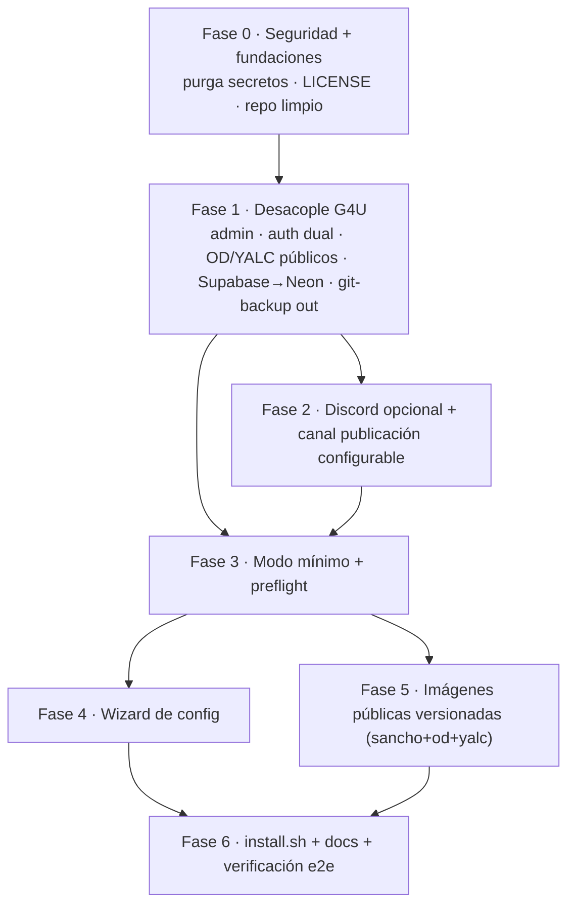

# Plan: paquetizar SanchoCMO como producto instalable por terceros

## Context

SanchoCMO hoy es una instancia operada por Growth4U sobre un repo privado + infra propia.
El objetivo es convertirlo en un **producto que cualquiera pueda descargar, configurar con un
paso simple y correr** (local o en su propio servidor), con updates triviales.

Decisiones del usuario (esta sesión):
1. Destinatario: **terceros / open source**.
2. **Discord ya no es interfaz**: la interacción es por Mission Control (chat web → Sancho).
3. Distribución: **híbrido** = imágenes Docker versionadas (núcleo) + instalador/wizard fino encima.
4. **OD y YALC deben venir de imágenes públicas** (resolver su publicación pública). Siguen siendo
   servicios opcionales (overlays), pero la imagen debe ser pública — no "bring your own build".
5. **Canal de publicación de crons**: hoy publican en Discord (y algunos en Slack). Hacerlo
   **configurable (slack|discord)**; si resulta muy complejo, **centralizar en Slack** (Slack ya
   tiene integración OAuth multi-tenant lista, ver `.env.example:61-71`, `src/pages/api/integrations/slack/`).
6. **Backups por git eliminados**: los datos de instancia ya tienen otro mecanismo de backup, así
   que se retira todo el flujo de "Cervantes hace git commit+push de backup".
7. **Supabase eliminado → Neon**: quitar toda referencia a Supabase (~44 archivos). `DATABASE_URL`
   ya apunta a Neon (`.env.example:34`).
8. **Auth de modelos dual**: tanto Anthropic como OpenAI deben poder usarse con **API key o con
   suscripción** (Anthropic: claude-cli; OpenAI: suscripción Codex). Hoy ambos están forzados a
   suscripción.

**Veredicto: factible, esfuerzo medio (~3–4 semanas ing. + 1 semana de prueba en infra limpia).**
La base es sólida (100% dockerizado, `release-please` ya versiona, separación framework/instancia
parcial vía `config/` gitignored + symlinks en `entrypoint.sh`, y `mc-chat → sancho` ya funciona sin
Discord). El trabajo es desacoplar de G4U, purgar secretos, hacer OD/YALC opcionales con imagen
pública, arreglar auth dual, retirar Discord/Supabase/git-backups, parametrizar canal de publicación,
añadir wizard y publicar imágenes. No es una reescritura.

---

## Shape del cambio

```
HOY (acoplado a G4U, no distribuible)            OBJETIVO (producto)
─────────────────────────────────────           ─────────────────────────────
git clone privado + compose build                docker compose pull (imágenes
OD obligatorio (imagen privada, falla              públicas versionadas vX.Y.Z)
  sin OD_API_TOKEN)                               OD/YALC = overlays opt-in, img pública
YALC build desde ../Yalc-Growth4U (privado)       auth: API key (default) o suscripción
auth forzada a suscripción (Anthropic+OpenAI)       (switch env, Anthropic + OpenAI)
admin = @growth4u.io hardcode                     admin = ADMIN_EMAIL_DOMAIN
Discord MUST + guild-por-cliente                  MC chat interfaz primaria
crons publican en Discord (IDs hardcodeados)      publish channel configurable (Slack default)
Cervantes hace git backup (commit+push)           backup externo (git-backup retirado)
Supabase (anon/service keys)                      Neon (DATABASE_URL)
secretos commiteados en git                       repo limpio, sin secretos
```

### Orden de dependencias entre fases



---

## GAP detallado

### A. Seguridad del repo — 🔴 BLOQUEANTE #1

Secretos vivos commiteados (verificado con `git ls-files`). No basta `.gitignore`: hay que reescribir
historial o partir de un repo nuevo, y **rotar** las credenciales expuestas.

| # | Archivo trackeado | Riesgo |
|---|-------------------|--------|
| A1 | `sancho-cmo.taild48df2.ts.net.key` | **Clave privada TLS de Tailscale** |
| A2 | `.env.bak-1778520082`, `.env.local.bak-1778526782` | Backups de `.env` con API keys reales |
| A3 | `openclaw.json.last-good` (84 KB) | Config OpenClaw con tokens de gateway/auth |
| A4 | `workspace-sancho/_system/instance.json` | Instance real (Supabase service_key, Discord IDs, cuentas) |
| A5 | `.mc-proxy-device.json` | Device auth del proxy MC |
| A6 | `new-client.sh:858` | **Supabase anon_key hardcodeada** dentro del script |
| A7 | `workspace-cervantes/supabase-migration.sql`, `*.bak` en skills, `workspace-cervantes/.env.example` | Auditar por valores reales |

### B. Acoplamiento a Growth4U — 🔴 bloqueante

| # | Actual | Ideal | Dónde |
|---|--------|-------|-------|
| B1 | Admin gate real es `email.endsWith("@growth4u.io")` en el callback de auth | Helper `isAdminEmail()` que lea `ADMIN_EMAIL_DOMAIN` (+ `adminEmails`) | **`src/pages/api/auth/[...nextauth].ts:79`** (gate) y `:45` (email del admin token); call-sites: `users.ts:29`, `admin-emails.ts:46`, `client-access.ts:73`, `dashboard/admin/users.tsx`, `health-check.ts:323` (`alfonso@growth4u.io`) |
| B2 | **Open Design es obligatorio**: en `docker-compose.yml` base con `OD_API_TOKEN: ${OD_API_TOKEN:?...}` → `compose up` falla sin OD | Mover servicio `open-design` a overlay `docker-compose.od.yml`; **imagen pública** `ghcr.io/<org>/od:vX.Y.Z` (publicar el fork) en vez de la privada | `docker-compose.yml:65-133`, `.env.example:159-167` |
| B3 | YALC build desde repo privado `../Yalc-Growth4U` | Mantener overlay `docker-compose.yalc.yml` pero con `image:` **pública** `ghcr.io/<org>/yalc:vX.Y.Z` (no `build:` privado) | `docker-compose.yalc.yml` |
| B4 | Volumen monta `brand/growth4u/...` hardcodeado | Va con overlay OD; parametrizar por brand o quitar del base | `docker-compose.yml:108` |
| B5 | **Git backups de Cervantes** (git config + daily commit+push) | **Retirar** todo el flujo (decisión #6): quitar `git config` del Dockerfile, montaje `~/.ssh`, y crons/skills de backup | `Dockerfile:39-40`, `docker-compose.yml:18`, crons de backup, README |
| B6 | **Supabase** en ~44 archivos | **Eliminar** (decisión #7): `instance.json.example` (bloque `supabase`), `clients.json.example` (`supabase`), `new-client.sh` (insert + key), `health-check.ts`, `src/pages/api/clients/create.ts`, `src/pages/api/env/index.ts`, `regenerate.py`, `workspace-cervantes/supabase-migration.sql`, docs/skills. Persistencia = Neon (`DATABASE_URL`) | grep `supabase` (44 files) |
| B7 | Falta `LICENSE.md` (README lo cita); docs usan `sanchocmo.ai`/IPs | Crear `LICENSE.md`; placeholders genéricos | raíz, `docs/` |

### C. Auth de modelos (Anthropic + OpenAI) — 🔴 bloqueante

El camino de **API key está roto hoy** para ambos proveedores:
- Anthropic: `generate-openclaw-config.js:40-46` borra `anthropic:default` y fuerza `anthropic:claude-cli` (oauth); `ensure-anthropic-subscription-auth.js` (`entrypoint.sh:117`) corre **en cada boot** y **elimina** profiles de API key de `openclaw.json` y de cada `auth-profiles.json`.
- OpenAI: `sync-codex-auth.sh` (`entrypoint.sh:108`) colapsa los `auth-profiles.json` a la **suscripción Codex** (ChatGPT OAuth); `OPENAI_API_KEY` existe en env pero no se cablea como profile. El plugin `codex` se fuerza `enabled` (`entrypoint.sh:72`).

**Ideal (decisión #8):** dos switches —`ANTHROPIC_AUTH_MODE` y `OPENAI_AUTH_MODE` (`api_key|subscription`, default `api_key`)—:
- En `api_key`: generar profile de API key (`anthropic:default` desde `ANTHROPIC_API_KEY`; equivalente OpenAI desde `OPENAI_API_KEY`) y **no** correr el script de suscripción correspondiente.
- En `subscription`: comportamiento actual.
- Gatear `ensure-anthropic-subscription-auth.js` y `sync-codex-auth.sh` al modo respectivo en `entrypoint.sh`.

### D. Discord opcional + canal de publicación configurable — 🟠

| # | Actual | Ideal | Dónde |
|---|--------|-------|-------|
| D1 | `DISCORD_BOT_TOKEN=your-bot-token` figura como requerido | Comentado/opcional | `.env.example:19` |
| D2 | `channels.discord.enabled=true` **siempre** | Gatear todo el bloque Discord a presencia del token | `generate-openclaw-config.js:95` |
| D3 | `instance.json.example` pide `discord.*` como base | Bloque Discord opcional | `config/instance.json.example` |
| D4 | `new-client.sh` exige `--guild`, inserta en Supabase, auto-bind Discord, `tools.deny` por guild | Reescribir: crea brand + registra en `clients.json` (genera `mcToken`) **sin** guild/Supabase/Discord | `workspace-sancho/scripts/new-client.sh` |
| D5 | **Crons publican en Discord** con `message(channel=discord,…)` + patrón de hilo, leyendo `crons.<x>.publish_channel` de `client-config.json` | **Canal configurable (decisión #5)**: añadir `publish.channel_type` (`slack`/`discord`) en `instance.json`/`client-config.json`; parametrizar el paso "PUBLICAR" de las plantillas de cron. **Default Slack** (OAuth ya construido). Si dual-channel resulta caro → centralizar en Slack y dejar Discord como legacy | `cron/jobs.json*`, `client-config.json`, `meeting-intelligence-db.ts:363` (`publish_channel`), `skills/atalaya/SKILL.md:100` |
| D6 | README gira en torno a "guild por cliente" + diagrama Discord | Reescribir alrededor de Mission Control + chat | `README.md:5-40` |

> 🟢 El boot **no** crashea sin Discord (`generate-openclaw-config.js:192` solo warning) y `mc-chat → sancho` se crea siempre (`:147`, reforzado en `entrypoint.sh:139`). Es limpieza, no re-arquitectura.

### E. Config inicial / wizard — 🟠 corazón del pedido

| # | Actual | Ideal |
|---|--------|-------|
| E1 | Editar a mano `.env` + `config/instance.json` + `config/clients.json` | Wizard que pregunta lo esencial y los genera |
| E2 | Secrets a mano (`openssl rand`): `NEXTAUTH_SECRET`, `ENCRYPTION_KEY`, `SANCHO_INTERNAL_API_TOKEN`, `mcToken`/`adminToken` | El wizard los genera |
| E3 | Sin preflight de config al boot | Preflight que falla rápido listando MUST faltantes |
| E4 | Crear 1er cliente requiere guild Discord | Crear 1er brand sin Discord (vía `new-client.sh` reescrito) |

**MUST mínimos reales (verificado):** API key del proveedor elegido (`ANTHROPIC_API_KEY` y/o `OPENAI_API_KEY`) · `config/clients.json` · `config/instance.json` (mínimo) · `NEXTAUTH_SECRET`. `DATABASE_URL` (Neon) solo si `MC_TASKS_BACKEND=db` (default `json`, sin DB — `docker-compose.yml:30`). Google OAuth opcional (fallback legacy token en `nextauth.ts:30-67`). Discord/YALC/OD/Slack: opcionales.

### F. Distribución y updates — 🟠

| # | Actual | Ideal |
|---|--------|-------|
| F1 | `git clone` + `compose build`; update = `git pull` + rebuild | Imágenes públicas `ghcr.io/<org>/sanchocmo:vX.Y.Z`; update = cambiar tag + `compose pull && up -d` |
| F2 | OD/YALC en build context o imagen privada bloquean `compose pull` | **Publicar OD y YALC como imágenes públicas** (decisión #4) y referenciarlas en sus overlays |
| F3 | Deploy asume infra G4U (GitHub Environments, deploy keys, secrets) | Documentar update genérico, sin Actions de G4U |
| F4 | `release-please` ya versiona | Reusar: release `vX.Y.Z` → tag de imagen |
| F5 | `~/.ssh:/root/.ssh:ro` y `/mnt/data/snapshots` montados | `~/.ssh` se retira con git-backup (B5); `/mnt/data` opcional | `docker-compose.yml:18-19` |

### G. Separación framework vs instancia — 🟢 casi resuelto

`config/*.json` gitignored con `.example`, `brand/` gitignored, symlinks en `entrypoint.sh:15-20`,
seeds en `templates/`, seeding gateado por existencia de `openclaw.json` (`entrypoint.sh:25`).
Falta garantizar que un `compose pull` de versión nueva no pise datos del volumen (`OPENCLAW_HOME`).

---

## Recomendación de distribución (híbrido)

1. **Imágenes públicas versionadas (núcleo).** Publicar `sanchocmo:vX.Y.Z` + `od:vX.Y.Z` + `yalc:vX.Y.Z`
   en GHCR público desde `release-please`. `docker-compose.yml` de producto referencia tags (sin `build`);
   OD/YALC en overlays opt-in. Update = editar tag + `compose pull && up -d`.
2. **Instalador/wizard fino encima.** `install.sh` baja compose + `.env.example`, corre el wizard
   (genera secrets, pide API key + dominio, crea 1er brand), valida con preflight y `compose up`.

**Canal de publicación:** recomiendo **default Slack** (la integración OAuth multi-tenant ya existe),
dejando `publish.channel_type` configurable a `discord` para quien lo prefiera. Si soportar ambos en
las plantillas de cron resulta caro, centralizar en Slack y marcar Discord como legacy.

---

## Plan de acción por fases

### Fase 0 — Seguridad + fundaciones (2–3 días) 🔴
- **Purgar secretos**: repo público nuevo sin historial (o reescritura de historial). Borrar/ignorar A1–A7. **Rotar** clave Tailscale y todo token de `openclaw.json.last-good`/`.env.bak`/`instance.json`.
- Quitar Supabase anon_key hardcodeada de `new-client.sh:858`.
- Auditar `workspace-*` por data de clientes G4U; decidir qué se publica.
- Crear `LICENSE.md` (texto SUL real). Confirmar org/registry GHCR público.

### Fase 1 — Desacople de G4U (4–6 días) 🔴
- **Admin configurable**: helper `isAdminEmail()` (lee `ADMIN_EMAIL_DOMAIN` + `adminEmails`); reemplazar hardcode en `nextauth.ts:79` y call-sites; parametrizar email del admin token (`nextauth.ts:45`).
- **Auth dual (C)**: `ANTHROPIC_AUTH_MODE` y `OPENAI_AUTH_MODE` en `generate-openclaw-config.js`; en `api_key` generar profile de API key y saltar el script de suscripción. Gatear `ensure-anthropic-subscription-auth.js` y `sync-codex-auth.sh` por modo (`entrypoint.sh:108,117`).
- **OD/YALC públicos + opcionales**: mover `open-design` a `docker-compose.od.yml` con imagen pública `ghcr.io/<org>/od`; YALC overlay con imagen pública `ghcr.io/<org>/yalc`; quitar OD del base. Confirmar degradación limpia en MC (`src/lib/open-design/client.ts`, `src/lib/yalc/client.ts` + UI).
- **Supabase → Neon (B6)**: eliminar referencias en config examples, `new-client.sh`, `health-check.ts`, `api/clients/create.ts`, `api/env/index.ts`, `regenerate.py`, docs/skills.
- **Retirar git-backup (B5)**: quitar `git config` (`Dockerfile:39-40`), montaje `~/.ssh` (`docker-compose.yml:18`), crons/skills de backup y mención en README.
- Limpiar `health-check.ts:323` y placeholders de dominio.

### Fase 2 — Discord opcional + canal de publicación (2–3 días) 🟠
- `.env.example:19` comentar `DISCORD_BOT_TOKEN`; `generate-openclaw-config.js` gatear `channels.discord` a presencia del token; `instance.json.example` bloque discord opcional.
- **Reescribir `new-client.sh`**: sin `--guild`/Supabase/auto-bind; crea brand + registra en `clients.json` (genera `mcToken`); conservar proyectos P00.
- **Canal configurable (D5)**: `publish.channel_type` en `instance.json`/`client-config.json`; parametrizar el paso "PUBLICAR" de las plantillas de cron (default Slack). Si es caro, centralizar en Slack.
- Reescribir `README.md` alrededor de Mission Control.

### Fase 3 — Modo mínimo + preflight (2–3 días) 🟠
- **Preflight** en `entrypoint.sh` (antes de `gateway run`): validar MUST (API key del modo activo, `NEXTAUTH_SECRET`, `config/clients.json`, `config/instance.json`) y abortar con mensaje accionable.
- Verificar seeding idempotente solo first-run; que `pull` de versión nueva no pisa el volumen.
- Perfil "mínimo" de compose: solo `sanchocmo`, `MC_TASKS_BACKEND=json`, sin DB/OD/YALC/Discord.

### Fase 4 — Wizard de configuración (4–6 días) 🟠 corazón del pedido
- Script CLI interactivo (reutilizable desde `install.sh`): elige proveedor + modo auth (api_key/suscripción), pide API key(s) + dominio + nombre del 1er brand; genera `NEXTAUTH_SECRET`, `ENCRYPTION_KEY`, `SANCHO_INTERNAL_API_TOKEN`, `adminToken`, `ADMIN_EMAIL_DOMAIN`; opcionalmente configura canal de publicación (Slack/Discord); escribe `.env`, `config/instance.json`, `config/clients.json` (desde `.example`); crea 1er brand vía `new-client.sh` reescrito; valida con preflight.
- Reusar `config/*.example` y `new-client.sh`; `openssl rand` para secrets.

### Fase 5 — Imágenes públicas versionadas (3–4 días) 🟠
- Workflow que publica `sanchocmo`, `od`, `yalc` `:vX.Y.Z`+`:latest` en GHCR público al release (engancha a `release-please`).
- `docker-compose.yml` de producto con `image:` (sin `build:`); overlays `docker-compose.od.yml` y `docker-compose.yalc.yml` con imágenes públicas.
- Documentar update genérico (`pull && up -d`); `/mnt/data` opcional.

### Fase 6 — Instalador + docs + verificación (2–3 días)
- `install.sh`: baja compose + `.env.example`, corre wizard, `compose up`.
- Guías de instalación (local + servidor) y de actualización.
- Verificación e2e en máquina limpia (abajo).

---

## Verificación (end-to-end)

En un host sin nada de G4U (sin acceso a repos/imágenes privadas):

1. **Instalación limpia**: `install.sh`; wizard solo con una API key + dominio/localhost.
2. **Arranque mínimo**: la app levanta **sin** Discord, OD, YALC, Slack ni Postgres (`json`); `GET /api/health` responde `{ ok, version, commit }` y `:18789/healthz` OK.
3. **Auth dual real**: con `ANTHROPIC_AUTH_MODE=api_key` (y/o OpenAI), un turno de chat infiere con la API key; inspeccionar `openclaw.json` → `auth.order.anthropic=["anthropic:default"]` (y equivalente OpenAI). Repetir con `subscription`.
4. **Uso básico**: entrar a MC, loguear, ver el brand del wizard, conversar por `mc-chat → sancho`.
5. **Admin configurable**: con `ADMIN_EMAIL_DOMAIN`, un email del dominio entra como admin; otro como client.
6. **Sin Supabase / sin git-backup**: confirmar que ningún path llama a Supabase y que no hay crons/commits de backup.
7. **Canal de publicación**: configurar Slack, verificar que un cron publica en Slack; (si dual) repetir con Discord.
8. **Preflight**: borrar `NEXTAUTH_SECRET` → boot aborta con mensaje claro.
9. **Update**: cambiar tag `vX.Y.Z → vX.Y.(Z+1)`, `compose pull && up -d`; brand/config del volumen **persisten** y `/api/health` reporta nueva versión.
10. **Opcionales**: habilitar overlay OD y/o YALC (imágenes públicas); integran sin romper el modo base; sin ellos MC degrada sin pantallas rotas.

---

## Riesgos / cuestiones abiertas

- **Purga de secretos del historial git** (Fase 0): clave TLS privada, `.env.bak`, `openclaw.json.last-good`, `instance.json` real trackeados. Repo nuevo limpio + rotación de credenciales.
- **Publicación pública de OD/YALC**: requiere derecho a publicar el fork de OD y el repo YALC como imágenes OSS/redistribuibles (licencia + CI de build). Validar antes de Fase 5.
- **Canal de publicación dual**: parametrizar el paso "PUBLICAR" en todas las plantillas de cron (patrón de hilo Discord vs Slack) puede ser costoso; fallback = centralizar en Slack.
- **Auth dual end-to-end**: validar modelos en allowlist de crons (`ensure-openclaw-allowlist.sh`, `entrypoint.sh:182`) con API key.
- **Crons/skills** con supuestos de G4U (canales, cuentas, paths) más allá de lo mapeado — Fase 1 incluye auditoría de `workspace-sancho/skills` y `scripts/`.
- **Licencia SUL**: el README la cita pero no existe el texto; redactarla (decisión del usuario).
